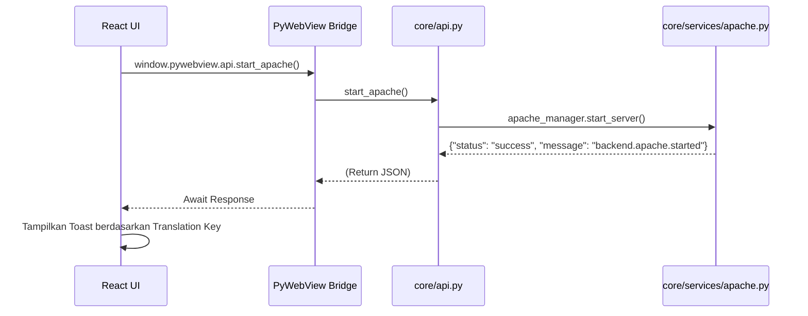

# Arsitektur & Alur Aplikasi (Flow)

VyloServe dibangun dengan arsitektur **Desktop Hybrid** di mana Backend dikendalikan oleh Python, namun antarmuka menggunakan teknologi Web modern (React). Penghubungnya adalah pustaka Python bernama `pywebview`.

## 1. Konsep Jembatan PyWebView (API Bridge)
Tidak seperti aplikasi web tradisional yang berkomunikasi lewat HTTP (REST API), VyloServe menggunakan *JavaScript Interop* melalui objek window browser.

1. **Inisialisasi Backend:** Di `main.py`, Python membuat kelas `Api` (dari `core/api.py`). Objek ini diekspos ke antarmuka saat *window* dibuat.
2. **Reaksi Frontend:** Di React, objek tersebut diakses melalui `(window as any).pywebview.api`.
3. **Panggilan Fungsi:** Saat frontend memanggil fungsi `api.start_apache_server()`, perintah ini dieksekusi **secara langsung** di runtime Python (Synchronous/Asynchronous).
4. **Respon (Return):** Fungsi Python wajib mengembalikan (return) sebuah Dictionary (JSON) yang berisikan kunci `status` (`"success"` / `"error"`) dan `message` (berupa **Translation Key**).



## 2. Event Emitter (Python -> React)
Karena fungsi backend yang panjang (seperti *download* engine) bisa memblokir antarmuka, backend **dilarang** mengembalikan progress bar lewat *return*. Backend harus *menembakkan* event (emit) secara real-time.

Di `core/api.py`, fungsi `emit_log` dan `emit_progress` diatur untuk mengeksekusi *CustomEvent* JavaScript di window React.

```python
# Di dalam Python (Backend)
def emit_progress(self, percentage, message_key):
    # Mengevaluasi JS langsung di UI
    self.window.evaluate_js(f"window.dispatchEvent(new CustomEvent('vylo_progress', {{detail: {{percentage: {percentage}, message: '{message_key}'}}}}))")
```

Di frontend (React), komponen `<BackgroundProgressWidget>` akan mendengarkan event tersebut dan merender Progress Bar mengambang (overlay) secara real-time.

## 3. Sistem i18n *Frontend-Driven*
Untuk mendukung multibahasa, aplikasi menerapkan prinsip **Frontend-Driven i18n**. 
Aturan Emas: **Backend Python DILARANG keras mengembalikan pesan hardcode.**

Backend harus mereturn sebuah kunci terjemahan (*translation key*), yang kemudian akan diterjemahkan oleh React (menggunakan library `react-i18next`).
```python
# BENAR:
return {"status": "success", "message": "backend.project.install_success"}
# SALAH:
return {"status": "success", "message": "Aplikasi berhasil dijalankan"}
```

## 4. Alur Keluar (Graceful Exit)
Aplikasi memiliki *System Tray* (ikon di pojok kanan bawah Windows).
- Jika pengguna menekan tanda silang (X) pada Window di mode *Production*, aplikasi **TIDAK AKAN** tertutup. Melainkan hanya sembunyi (Hide) ke *System Tray*, membiarkan proses Apache/PHP/Database tetap berjalan di latar belakang.
- Aplikasi hanya benar-benar mati jika fungsi `api.close_app()` dipanggil (lewat menu "Quit" di tray atau UI).
- Saat `close_app()` dipanggil, semua manager (seperti `php.stop_all()`, `apache.stop_server()`) akan dieksekusi agar tidak ada proses siluman (*zombie process*) yang tertinggal di OS.
