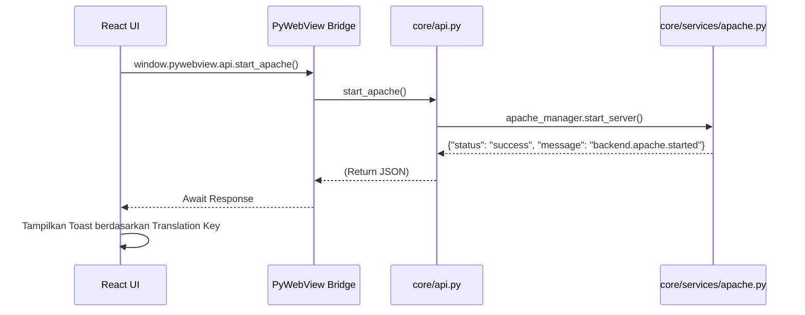

# Arsitektur & Alur Aplikasi (Flow)

VyloServe dibangun dengan arsitektur **Desktop Hybrid** di mana Backend dikendalikan oleh Python, namun antarmuka menggunakan teknologi Web modern (React). Penghubungnya adalah pustaka Python bernama `pywebview`.

## 1. Konsep Jembatan PyWebView (API Bridge)
Tidak seperti aplikasi web tradisional yang berkomunikasi lewat HTTP (REST API), VyloServe menggunakan *JavaScript Interop* melalui objek window browser.

0. **Single-Instance Check (sebelum apa pun lain):** `main()` di `main.py` memanggil `check_single_instance()` (Windows Mutex bernama `VyloServe_App_Mutex_v1`) **sebelum** membuat `Api()`/window apa pun. Kalau mutex sudah dimiliki proses lain, proses baru ini tidak membuat window sama sekali — cukup memanggil `bring_existing_instance_to_front()` (via `user32.FindWindowW`/`SetForegroundWindow`) lalu `sys.exit(0)`. Warna latar window awal (`background_color` di `webview.create_window()`) juga sudah ditentukan di titik ini lewat `get_theme_bg_color()`, yang membaca key `theme` dari `data/settings.json` — ini mencegah "kedipan putih/hitam" sebelum CSS tema React sempat dimuat.
1. **Inisialisasi Backend:** Di `main.py`, Python membuat kelas `Api` (dari `core/api.py`). Objek ini diekspos ke antarmuka saat *window* dibuat. Segera setelah `api.set_window(window)`, `main()` juga memanggil `api.start_log_watcher()` — lihat §6 di bawah.
2. **Reaksi Frontend:** Di React, objek tersebut diakses melalui `(window as any).pywebview.api`.
3. **Panggilan Fungsi:** Saat frontend memanggil fungsi `api.start_apache_server()`, perintah ini dieksekusi **secara langsung** di runtime Python (Synchronous/Asynchronous).
4. **Respon (Return):** Fungsi Python wajib mengembalikan (return) sebuah Dictionary (JSON) yang berisikan kunci `status` (`"success"` / `"error"`) dan `message` (berupa **Translation Key**).


```mermaid
sequenceDiagram
    participant React UI
    participant PyWebView Bridge
    participant core/api.py
    participant core/services/apache.py
    
    React UI->>PyWebView Bridge: window.pywebview.api.start_apache()
    PyWebView Bridge->>core/api.py: start_apache()
    core/api.py->>core/services/apache.py: apache_manager.start_server()
    core/services/apache.py-->>core/api.py: {"status": "success", "message": "backend.apache.started"}
    core/api.py-->>PyWebView Bridge: (Return JSON)
    PyWebView Bridge-->>React UI: Await Response
    React UI->>React UI: Tampilkan Toast berdasarkan Translation Key
```

## 2. Event Emitter (Python -> React)
Karena fungsi backend yang panjang (seperti *download* engine) bisa memblokir antarmuka, backend **dilarang** mengembalikan progress bar lewat *return*. Backend harus *menembakkan* event (emit) secara real-time.

Di `core/api.py`, fungsi `emit_log` dan `emit_progress` diatur untuk mengeksekusi *CustomEvent* JavaScript di window React.

```python
# Di dalam Python (Backend) — core/api.py, disederhanakan (detail lengkap di docs/backend_services.md §2.2)
def emit_progress(self, percent: int, text: str = "", args: dict = None):
    source = self._resolve_event_source()  # auto-deteksi Manager pemanggil via inspect
    detail = json.dumps({"percent": percent, "text": text, "args": args or {}, "source": source})
    self.window.evaluate_js(f"window.dispatchEvent(new CustomEvent('vylo_progress', {{detail: {detail} }}));")
```

Di frontend (React), komponen `<BackgroundProgressWidget>` akan mendengarkan event tersebut dan merender Progress Bar mengambang (overlay) secara real-time.

> ⚠️ **Kontrak `percent` yang wajib dipatuhi:** nilainya selalu **absolut 0-100** (bukan fraksi), dan frontend memperlakukan **`percent >= 100` atau `percent <= 0` sebagai sinyal "proses selesai total"** — memicu auto-hide widget progress setelah jeda singkat. Backend **tidak boleh** mengirim `emit_progress(100, ...)` untuk checkpoint di tengah alur multi-tahap (hanya untuk tahap paling akhir). Dua bug produksi nyata pernah terjadi karena kontrak ini dilanggar/disalahtafsirkan — lihat `docs/known_bugs.md` #16 dan #18, serta `docs/frontend_ui.md` §3.4 untuk detail sisi frontend.

## 3. Sistem i18n *Frontend-Driven*
Untuk mendukung multibahasa, aplikasi menerapkan prinsip **Frontend-Driven i18n**. 
Aturan Emas: **Backend Python DILARANG keras mengembalikan pesan hardcode.**

Backend harus mereturn sebuah kunci terjemahan (*translation key*), yang kemudian akan diterjemahkan oleh React (menggunakan library `react-i18next`).
```python
# BENAR:
return {"status": "success", "message": "backend.project.install_success"}
# SALAH:
return {"status": "success", "message": "Aplikasi berhasil dijalankan"}
```

## 4. Alur Keluar (Graceful Exit)
Aplikasi memiliki *System Tray* (ikon di pojok kanan bawah Windows).
- Jika pengguna menekan tanda silang (X) pada Window di mode *Production*, aplikasi **TIDAK AKAN** tertutup. Melainkan hanya sembunyi (Hide) ke *System Tray*, membiarkan proses Apache/PHP/Database tetap berjalan di latar belakang.
- Aplikasi hanya benar-benar mati jika fungsi `api.close_app()` dipanggil (lewat menu "Quit" di tray atau UI).
- Saat `close_app()` dipanggil, `perform_exit()` di `main.py` memanggil `apache.stop_server()`, `php.stop_all()`, dan `database.stop_all()` (masing-masing dibungkus try/except sendiri) sebelum System Tray & window dihentikan dan `os._exit(0)` dipanggil — mencegah proses child (`httpd.exe`, `php-cgi.exe`, `mysqld.exe`/`postgres.exe`) tertinggal sebagai *zombie process*. ✅ *Catatan audit:* sempat ditemukan versi kode di mana pemanggilan cleanup ini hilang (lihat riwayat di `docs/known_bugs.md` #6) — sudah dikonfirmasi diperbaiki.

## 5. Pola Async Gabungan: Request-Response + Event Streaming
Alur seperti instalasi Apache/PHP/Database/Runtimes **bukan** sekadar satu `await` sederhana seperti pada diagram di §1. Polanya adalah kombinasi dua mekanisme yang berjalan paralel:
1. Frontend memanggil `api.install_x(...)` dan menunggu (`await`) **satu** response akhir (`{status, message}`).
2. **Selama** proses itu berjalan di backend, event `vylo_progress` dan `vylo_log` ditembakkan berkali-kali secara independen ke `window` — komponen frontend (halaman modul + `LogsPanel`) mendengarkan event ini secara terpisah dari `await` di atas, sehingga progress bar/log ter-update *real-time* walau response akhir baru diterima setelah proses selesai total.

Lihat `docs/frontend_ui.md` §6 untuk sequence diagram lengkap alur ini, termasuk pola "minimize modal" (`BackgroundProgressWidget`) dan potensi *event leak* lintas modul (`docs/known_bugs.md` #7).

## 6. Pola Async Ketiga: Background Push Berkelanjutan (Log Watcher)

Berbeda dari §5 (event yang hanya mengalir **selama** satu aksi user tertentu berjalan, mis. instalasi), ada satu mekanisme yang **tidak pernah berhenti dan tidak dipicu aksi user apa pun**: *log watcher*.

- `Api.start_log_watcher(interval=2.0)` (dipanggil sekali saat bootstrap, §1 poin 1) menjalankan **satu thread daemon** yang berjalan sepanjang hidup aplikasi — pola yang sama seperti thread System Tray di §4, bukan `asyncio`/event loop.
- Tiap `interval` detik (default 2 detik), thread ini memanggil `ApacheManager.tail_new_logs()` dan `DatabaseManager.tail_new_logs()`, yang membaca baris **baru** (sejak polling terakhir) di `logs/error_log`/`logs/access_log` Apache dan `db_startup.log`/`*.err` Database — **hanya** untuk servis yang sedang berjalan.
- Setiap baris baru diteruskan lewat `emit_log(line, level, {}, source_override='ApacheFileLog'|'DatabaseFileLog')` — parameter `source_override` memaksa kategori tertentu, mem-bypass auto-detection nama class pemanggil (`_resolve_event_source()`, §2), supaya baris file log bisa difilter terpisah dari pesan sistem biasa di panel Log (lihat `docs/known_bugs.md` #26).
- `Api.stop_log_watcher()` menghentikannya dengan bersih saat `AppLifecycle.perform_exit()` (§4).

Detail lengkap mekanisme tail-file (offset tracking, retry saat file terkunci Windows, dsb.): `docs/backend_services.md` §11.2. Detail sisi frontend (filter level/kategori, UI toggle): `docs/frontend_ui.md` §12.
