# Backend Services (Logika Python) — Dokumentasi Mendalam

> **Metodologi dokumen ini:** Setiap bagian di bawah ditulis berdasarkan audit langsung terhadap source code (`core/api.py`, `core/services/*.py`, `core/utils/*.py`, `main.py`), bukan asumsi dari dokumentasi sebelumnya. Setiap *workflow* (install, start, stop, dsb) disertai diagram Mermaid yang menggambarkan urutan langkah persis seperti yang terjadi di kode — termasuk percabangan error dan pemanggilan lintas-service. Bagian [§13](#13-known-issues--temuan-audit-backend) mendaftar semua ketidaksesuaian antara dokumentasi lama dan kode nyata yang ditemukan saat audit ini, termasuk **bug fungsional yang masih aktif**.
>
> Dokumen ini ditujukan untuk dibaca developer maupun AI Assistant. Setiap service dijelaskan secara *atomic* (satu tanggung jawab per bagian) dengan urutan: Dependency → State/Storage → API Publik → Workflow (diagram) → Helper Privat → Ketergantungan Lintas-Service.

---

## Daftar Isi

1. [Peta Dependency Antar Service](#1-peta-dependency-antar-service)
2. [`core/api.py` — Api Facade & Event Emitter](#2-coreapipy--api-facade--event-emitter)
3. [Lapisan Utilitas (`core/utils/`)](#3-lapisan-utilitas-coreutils)
4. [`ApacheManager` (`apache.py`)](#4-apachemanager-apachepy)
5. [`PhpManager` (`php.py`)](#5-phpmanager-phppy)
6. [`DatabaseManager` (`database.py`)](#6-databasemanager-databasepy)
7. [`ProjectManager` (`project.py`)](#7-projectmanager-projectpy)
8. [`RuntimesManager` (`runtimes_manager.py`)](#8-runtimesmanager-runtimes_managerpy)
9. [`GitManager` (`git_manager.py`)](#9-gitmanager-git_managerpy)
10. [`SslManager` (`ssl_manager.py`)](#10-sslmanager-ssl_managerpy)
11. [`DashboardManager` & `SettingsManager`](#11-dashboardmanager--settingsmanager)
12. [`main.py` — App Bootstrap & `AppLifecycle`](#12-mainpy--app-bootstrap--applifecycle)
13. [Known Issues — Temuan Audit Backend](#13-known-issues--temuan-audit-backend)

---

## 1. Peta Dependency Antar Service

Semua manager diinisialisasi di `Api.__init__()` dan menerima referensi ke `Api` itu sendiri (`self.api`), sehingga setiap manager bisa mengakses manager lain lewat `self.api.<nama_manager>`. Dependency **tidak dideklarasikan di constructor** — semua bersifat *lazy* (dicek dengan `hasattr(self.api, 'xxx')` saat method dipanggil), sehingga urutan inisialisasi di `Api.__init__()` tidak masalah, tapi ini juga berarti **tidak ada validasi startup** yang memastikan semua dependency benar-benar ada.

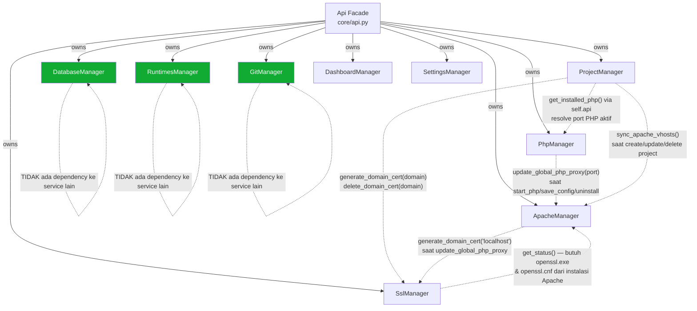

**Poin penting:**
- **`SslManager` ↔ `ApacheManager` saling bergantung** dua arah: Apache butuh Ssl untuk generate cert `localhost`, sementara Ssl butuh path `openssl.exe` dari instalasi Apache. Jika Apache belum terinstall, `SslManager` akan melempar `RuntimeError`, tapi karena semua pemanggilnya (`Apache`, `Project`) membungkusnya dalam `try/except`, kegagalan ini **selalu silent-downgrade ke HTTP-only** — tidak pernah muncul sebagai error ke UI.
- `DatabaseManager`, `RuntimesManager`, dan `GitManager` benar-benar independen — aman untuk ditest/dimodifikasi tanpa mempengaruhi service lain.
- `PhpManager` dan `ApacheManager` **saling bergantung erat** melalui port FastCGI proxy — lihat diagram di [§4.3](#43-workflow-start-server-dengan-handshake-php-proxy) dan [§5.2](#52-workflow-start_phpversion).

---

## 2. `core/api.py` — Api Facade & Event Emitter

`Api` adalah satu-satunya class yang diekspos ke `window.pywebview.api` di frontend. Semua fungsi JS masuk lewat sini, lalu didelegasikan ke manager yang sesuai.

### 2.1 Constructor
Menginisialisasi 9 manager (`self.apache`, `self.php`, `self.database`, `self.project`, `self.runtimes`, `self.git`, `self.ssl`, `self.dashboard`, `self.settings`), masing-masing menerima `self` (instance `Api`) sebagai referensi balik. `self._window = None` (di-set belakangan oleh `main.py` via `set_window()`). `self.quit_callback = None` (di-set oleh `main.py` agar `close_app()` bisa memicu pembersihan sebelum keluar — lihat [§13](#13-known-issues--temuan-audit-backend) untuk status nyata pembersihan ini).

### 2.2 Event Emitter — Mekanisme Inti Komunikasi Real-Time

```python
def emit_log(self, message: str, level: str = "info", args: dict = None):
    if self._window:
        source = self._resolve_event_source()
        detail = json.dumps({"message": message, "level": level, "args": args or {}, "source": source})
        self._window.evaluate_js(f"window.dispatchEvent(new CustomEvent('vylo_log', {{detail: {detail} }}));")

def emit_progress(self, percent: int, text: str = "", args: dict = None):
    if self._window:
        source = self._resolve_event_source()
        detail = json.dumps({"percent": percent, "text": text, "args": args or {}, "source": source})
        self._window.evaluate_js(f"window.dispatchEvent(new CustomEvent('vylo_progress', {{detail: {detail} }}));")
```

- `json.dumps()` dipakai untuk membangun payload event → ini yang mencegah XSS/JS-injection saat men-embed string dinamis ke `evaluate_js()` (lihat standar security di `docs/development_testing.md`).
- **Kedua fungsi ini silent-no-op jika `self._window` belum di-set** — artinya jika `main.py` lupa memanggil `api.set_window(window)`, seluruh log & progress bar akan hilang tanpa error apapun. Ini pola debugging yang sudah benar didokumentasikan di `docs/ai_development_guide.md` §4.3.
- **`source`** diisi otomatis oleh `_resolve_event_source()` (memakai `inspect.currentframe()` untuk membaca nama class pemanggil dari stack frame, mis. `"ApacheManager"`) — pemanggil `_progress()`/`_log()` di tiap service **tidak perlu** mengisi field ini sendiri. Frontend memakai field ini untuk memfilter event yang bukan miliknya karena semua halaman selalu ter-*mount* bersamaan — lihat `docs/frontend_ui.md` §3.3.
- ⚠️ **Kontrak `percent`:** selalu angka **absolut 0-100** (bukan fraksi `0.0-1.0`), dan `percent >= 100`/`percent <= 0` **punya makna khusus di frontend** — ditafsirkan sebagai "proses benar-benar selesai" dan memicu auto-hide widget progress. Jangan panggil `_progress(100, ...)`/`emit_progress(100, ...)` untuk checkpoint di tengah alur multi-tahap; lihat §8.2 di bawah dan `docs/known_bugs.md` #16 & #18 untuk 2 bug nyata yang disebabkan pelanggaran kontrak ini.
- ⚠️ **Kontrak `message`/`text`:** SELALU translation key (`"backend.xxx.yyy"`), tidak pernah string literal — berlaku untuk `emit_log`/`emit_progress` maupun wrapper privat `_log()`/`_progress()` tiap service. **Setiap wrapper privat WAJIB menerima dan meneruskan parameter `args`** (signature: `def _log(self, msg: str, level: str = "info", args: dict = None)`), karena `emit_log`/`emit_progress` di atas sudah menyediakan slot `args` untuk interpolasi (`{{engine}}`, `{{version}}`, dst) — wrapper yang menelan/membuang `args` memaksa pemanggilnya menulis f-string mentah sebagai jalan pintas. Bug nyata: `RuntimesManager._emit_log()`/`_emit_progress()` awalnya tidak punya parameter `args` sama sekali, sehingga seluruh log deteksi instalasi eksternal Node/Python/Java/Go terkirim sebagai string Indonesia mentah walau bahasa aplikasi di-set English — lihat `docs/known_bugs.md` #19. Dicegah otomatis oleh `tests/test_i18n_keys.py`.

### 2.3 Endpoint Non-Delegasi Penting

| Endpoint | Perilaku |
|---|---|
| `close_app()` | Jika `self.quit_callback` di-set → panggil callback tersebut. Jika tidak → `os._exit(0)` langsung. **Lihat §13 untuk bug terkait fungsi ini.** |
| `browse_directory()` | Membuka native folder picker via `self._window.create_file_dialog(webview.FOLDER_DIALOG)`. |
| `start_service(id)` / `stop_service(id)` | Dispatcher generik dipakai oleh toggle switch di Sidebar & Dashboard — merutekan ke `apache`/`php`/`database` manager berdasarkan `id`. |
| `get_all_services_status()` | Menggabungkan `psutil.cpu_percent()` + `psutil.virtual_memory().percent` dengan status running tiap service — dipoll frontend tiap 2 detik. |

> ⚠️ Endpoint ini **tidak tercantum** di peta API lama `docs/ai_development_guide.md` §1 — lihat §13 poin 4–6 untuk daftar lengkap endpoint yang belum terdokumentasi.

---

## 3. Lapisan Utilitas (`core/utils/`)

### 3.1 `file_utils.py`

| Fungsi | Perilaku |
|---|---|
| `download_advanced(url, dest, log_cb, prog_cb)` | Kirim `HEAD` dulu untuk cek `Content-Length` & `Accept-Ranges`. Jika server mendukung *byte range* dan ukuran diketahui → `_download_multi_part()` (8 koneksi paralel, file di-*preallocate*, tiap thread menulis potongan byte-nya sendiri, progress digabung via `threading.Lock`). Jika tidak → `_download_single_stream()` (chunked 32KB). HTTP 404 dilempar ulang sebagai `RuntimeError` yang jelas. |
| `extract_archive(zip_path, dest, prog_cb)` | `.zip` → member-by-member (progress tiap 50 file). `.tar.gz` → `extractall()` sekali jalan (progress langsung loncat ke 80%, tidak granular). |
| `read_json(path, default_type=list)` | Baca JSON dengan aman. **Selalu mengembalikan tipe `default_type`** — jika file tidak ada/kosong/JSON tidak valid, ATAU jika isi file valid JSON tapi bertipe berbeda dari `default_type` (mis. file berisi string top-level padahal caller minta `dict`), otomatis fallback ke `default_type()` kosong. Lihat catatan kontrak di bawah. |
| `write_json(path, data)` | Tulis `data` sebagai JSON (`indent=4`), `os.makedirs` otomatis. Return `bool` sukses/gagal — **tidak validasi tipe `data`**, jadi caller tetap bertanggung jawab hanya mengirim `dict`/`list` yang sesuai konvensi file targetnya. |

> ✅ **Temuan audit (sudah diperbaiki):** dokumentasi versi lama mengklaim fungsi ini "mencegah *zip slip vulnerability*", padahal saat itu belum ada validasi path traversal apapun di `_extract_zip`/`_extract_tar_gz`. Sekarang sudah ditambahkan `_is_safe_extract_path()` — setiap member arsip divalidasi dengan `os.path.realpath()` sebelum diekstrak; member yang keluar dari direktori tujuan (mis. `../../evil.exe`) akan menggagalkan seluruh ekstraksi dengan `RuntimeError`. Detail di §13.

> ⚠️ **Kontrak tipe `read_json()`:** parameter `default_type` dulu **hanya** dipakai sebagai nilai fallback saat file tidak ada — bukan jaminan tipe hasil baca. Kalau file ADA dan isinya JSON valid tapi bukan `default_type` (mis. sisa string dari file lama/rusak/edit manual), fungsi lama meneruskan nilai itu apa adanya, sehingga caller yang langsung memanggil `.get()`/iterasi pada hasilnya (tanpa `isinstance` check sendiri) bisa crash. Sekarang `read_json()` sudah memvalidasi `isinstance(data, default_type)` setelah parsing — **hasilnya dijamin bertipe `default_type`**, jadi caller baru tidak perlu lagi menambahkan `isinstance` check sendiri untuk kasus ini. Detail insiden nyata di `docs/known_bugs.md` #17.

### 3.2 `system_utils.py`

| Fungsi | Perilaku |
|---|---|
| `get_project_root()` | Resolusi path aman baik mode `.py` (dev) maupun `.exe` (`sys.frozen`, PyInstaller). |
| `run_silent_command(cmd)` | Eksekusi sinkron tersembunyi (`CREATE_NO_WINDOW`). |
| `start_silent_process(cmd)` | Sama seperti di atas tapi asinkron (untuk daemon Apache/PHP/DB). |
| `check_port_in_use(port, host)` | Cek `socket.create_connection((host, port))` (IPv4) dulu; jika gagal **dan** host adalah `127.0.0.1`/`localhost`, fallback ke `AF_INET6` (`::1`). ✅ **Fix ini terverifikasi masih aktif dan benar** — lihat `docs/known_bugs.md` #1 (PostgreSQL IPv6 timeout). |

---

## 4. `ApacheManager` (`apache.py`)

### 4.1 Dependency & State
- **Constructor**: tidak butuh manager lain saat inisiasi — semua dependency (`self.api.project`, `self.api.ssl`) dicek lazy via `hasattr()` di dalam method.
- **State file**: `data/apache.json` → `{"active_version": "2.4.62"}`. Ada migrasi otomatis dari format lama `data/apache_active_version.txt` (dibaca sekali, ditulis ke JSON baru, file lama dihapus).

### 4.2 Ringkasan API Publik

| Method | Fungsi |
|---|---|
| `get_status()` | List versi terinstall di `bin/apache/`, resolve versi aktif (self-healing jika versi aktif tersimpan sudah tidak ada di disk). |
| `install_version(version, url, port)` | Download → extract → pindah folder → konfigurasi `httpd.conf` (lihat diagram §4.4). |
| `set_active_version(version)` | Ganti versi aktif → **trigger `project.sync_apache_vhosts()`** → restart jika sedang berjalan. |
| `start_server()` | Lihat diagram §4.3. |
| `stop_server()` | `taskkill /F /T /IM httpd.exe` (Windows). |
| `restart_server()` | `stop_server()` + sleep 1s + `start_server()`. |
| `update_global_php_proxy(port, restart=True)` | Menulis ulang `conf/extra/httpd-vyloserve-php.conf` agar proxy FastCGI menunjuk port PHP yang benar. Dipanggil oleh `PhpManager` setiap kali PHP start. |
| `uninstall(version)` | Hapus folder instalasi. |

### 4.3 Workflow: `start_server()` dengan Handshake PHP-Proxy

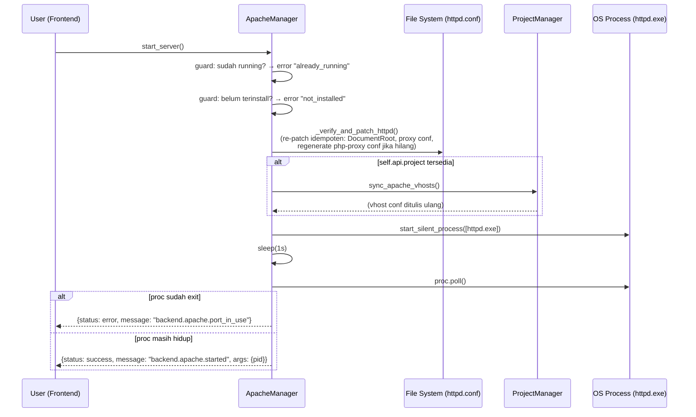

> ✅ **Catatan (sudah diperbaiki):** `sync_apache_vhosts()` yang dipanggil di sini sebelumnya menulis ke folder yang salah (`con/extra` bukan `conf/extra`) — lihat §13 poin 1 dan §7.3. Sudah dikoreksi ke `conf/extra`, sehingga virtual host project kini ikut ter-*load* dengan benar saat Apache di-start.

### 4.4 Workflow: `install_version(version, url, port)`

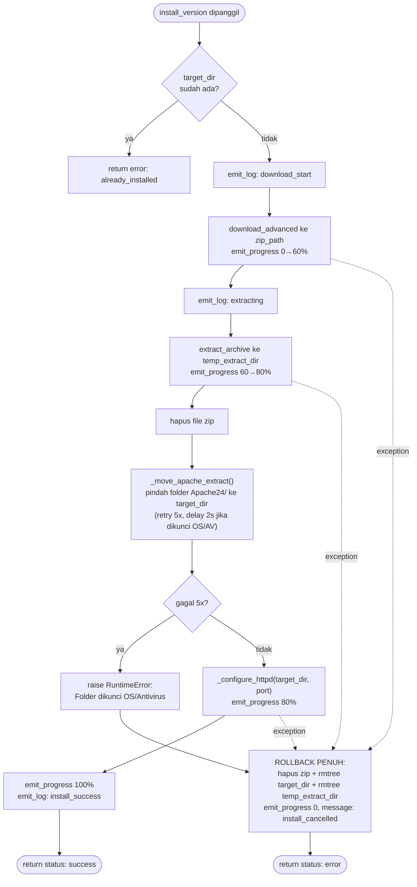

`_configure_httpd()` melakukan regex-patch pada `httpd.conf` (Set `SRVROOT`, `Listen {port}`, `DocumentRoot`, aktifkan `mod_proxy`/`mod_proxy_fcgi`) lalu memanggil `update_global_php_proxy(9000, restart=False)` — port `9000` di sini adalah **asumsi hardcoded** sebagai port PHP default awal (akan di-overwrite begitu PHP benar-benar start di port aslinya, lihat §5.2).

### 4.5 Dependency Lintas-Service (Ringkasan)
- **Butuh** `ProjectManager.sync_apache_vhosts()` — saat start, saat ganti versi aktif.
- **Butuh** `SslManager.generate_domain_cert("localhost")` — saat `update_global_php_proxy()`, untuk blok HTTPS `*:443`. Dibungkus try/except; gagal = skip HTTPS diam-diam.
- **Dibutuhkan oleh** `PhpManager` (proxy port), `ProjectManager` (restart setelah CRUD project), `SslManager` (path `openssl.exe`).

---

## 5. `PhpManager` (`php.py`)

### 5.1 Dependency & State
- `self.processes = {}` — dictionary in-memory `version → Popen`. **Tidak dipersist ke disk**, artinya jika aplikasi VyloServe sendiri di-restart, ia kehilangan jejak proses `php-cgi.exe` yang sebelumnya dia jalankan (proses OS-nya sendiri bisa saja tetap hidup sebagai orphan).
- Port FastCGI disimpan sebagai komentar di dalam `php.ini` itu sendiri (bukan file JSON terpisah).

### 5.2 Workflow: `start_php(version)`

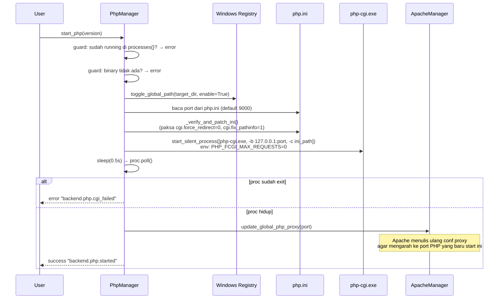

**Ini adalah handshake proxy PHP↔Apache** yang disebut di §4. Setiap kali PHP start di port manapun, ApacheManager langsung diberi tahu lewat panggilan langsung (bukan event), sehingga proxy FastCGI Apache selalu sinkron dengan port PHP yang benar-benar aktif.

### 5.3 Workflow: `toggle_global_path()` — Isolasi Multi-Versi di Registry PATH

Karena PHP mendukung banyak versi berjalan bersamaan, `toggle_global_path()` **selalu membersihkan dulu semua path yang berawalan `bin/php`** dari `HKCU\Environment\Path` sebelum (opsional) menambahkan versi yang baru — mencegah dua versi PHP saling menimpa di PATH sistem. Setelah menulis, ia broadcast `WM_SETTINGCHANGE` via `SendMessageTimeoutW` agar terminal baru langsung mengenali perubahan tanpa restart PC.

### 5.4 Ringkasan API Publik Lainnya

| Method | Fungsi |
|---|---|
| `install_version(version, filename, port)` | Download (dengan fallback URL untuk versi lama) → extract → tulis `php.ini` baru (port + `memory_limit=512M` + ekstensi dasar), lapor progress **92%** ("configuring") → `_install_composer()` (lapor **95%**) → **100%** ("installation_complete") hanya di titik ini, setelah Composer benar-benar terpasang. Progress 92% (bukan 100%) di tahap "configuring" itu sengaja — lihat catatan kontrak `percent` di §2.2 dan `docs/known_bugs.md` #18. |
| `stop_php(version)` | `taskkill /PID` → hapus dari `processes{}` → `toggle_global_path(enable=False)`. |
| `save_config(version, config, extensions)` | Rewrite `php.ini` baris-per-baris (`_update_ini_lines`, mempertahankan baris lain) → **jika Apache sedang berjalan, `restart_server()`**; jika ProjectManager ada, `sync_apache_vhosts()` (keduanya dibungkus bare `try/except: pass`). |
| `start_all()` / `stop_all()` | Baca `data/dashboard.json` → `selected_php` lewat `read_json(path, dict)` (dijamin `dict`, lihat §3.1) → `.get('selected_php', [])` (dipakai tombol "Start Selected" di Dashboard). Fallback ke versi terbaru terinstall jika belum ada preferensi tersimpan. |

### 5.5 ✅ Bug Ditemukan & Diperbaiki: Unbound Exception Variable

```python
# php.py — get_versions() — SEBELUM diperbaiki
except Exception:
    return {"status": "error", "message": str(e)}   # 'e' TIDAK terikat! → NameError
```
Sebelumnya, setiap kali fetch daftar versi PHP dari internet gagal (mis. tidak ada koneksi), alih-alih mengembalikan pesan error yang informatif, kode ini **melempar `NameError: name 'e' is not defined`** yang menutupi error asli. **Sudah diperbaiki** menjadi `except Exception as e:`. Bug identik ditemukan dan diperbaiki 2× lagi di `database.py` (§6.5).

---

## 6. `DatabaseManager` (`database.py`)

### 6.1 Dependency & State
- `bin_dir = bin/database/`, `config_path = data/databases.json` (list instance), `self.processes = {}` (in-memory, caveat sama seperti PHP).
- **Tidak bergantung pada service lain** — modul paling independen di codebase ini.

### 6.2 Workflow: `install_database(engine, version, url, port, root_pass)`

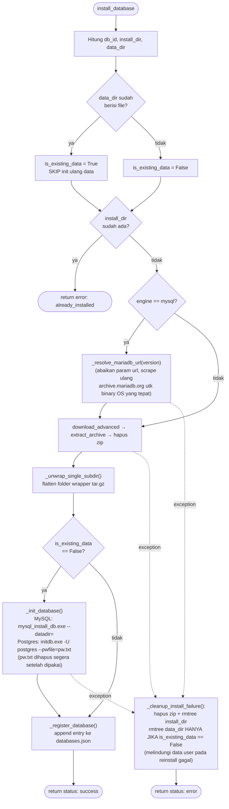

### 6.3 Workflow: `start_database(db_id)`

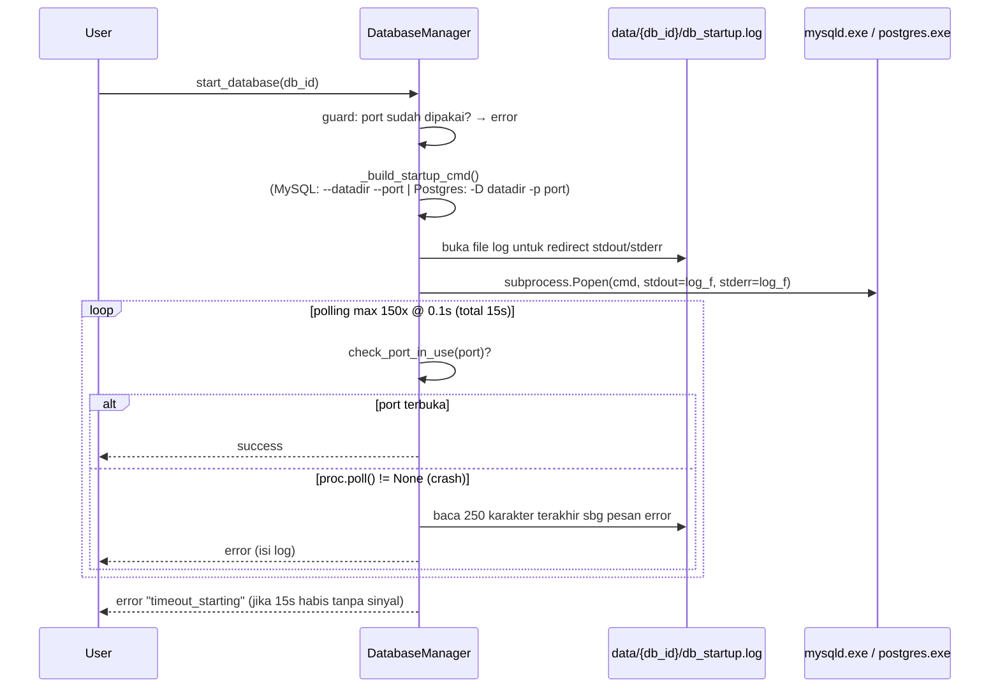

### 6.4 Workflow: `stop_database(db_id)` — Pola Kill-lalu-Graceful (Tidak Biasa)

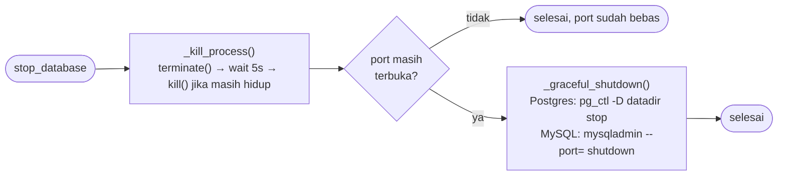

> **Catatan desain:** Urutan ini terbalik dari konvensi umum ("graceful dulu, baru force-kill jika gagal"). Di sini proses langsung di-*hard-kill*, dan command graceful hanya dipanggil **sebagai fallback kedua** bila port ternyata masih terbuka setelah kill. Ini bukan bug, tapi perilaku yang perlu diketahui developer karena bisa menyebabkan *unclean shutdown* pada database (risiko corruption pada kondisi tertentu) — pertimbangkan membalik urutan ini di masa depan jika ditemukan kasus data korup setelah stop.

### 6.5 ✅ Bug Ditemukan & Diperbaiki: Unbound Exception Variable (2×)
Pola identik dengan §5.5 ditemukan di `_fetch_mariadb_versions()` dan `open_path()` — keduanya sebelumnya punya `except Exception: return {..., "message": str(e)}` tanpa `as e`. Sudah diperbaiki menjadi `except Exception as e:` di keduanya.

### 6.6 Ringkasan API Publik Lainnya

| Method | Fungsi |
|---|---|
| `get_installed()` | Enrich status tiap instance secara paralel (`ThreadPoolExecutor`, 10 worker) — cek proses in-memory dulu, fallback ke `check_port_in_use()`. |
| `change_db_credentials(id, user, old, new)` | MySQL: `mysql.exe -e "ALTER USER..."`. Postgres: `psql.exe` + env `PGPASSWORD`. Non-zero exit → `RuntimeError` diparse jadi `{status: error, args: {err}}`. |
| `save_db_config(id, config)` | Patch `my.ini`/`postgresql.conf` baris-per-baris → **jika sedang jalan, stop lalu start ulang** agar config baru diterapkan. |

---

## 7. `ProjectManager` (`project.py`)

Modul paling kompleks — mengorkestrasi Composer, Apache vhost, Windows `hosts` file (UAC), dan SSL sekaligus.

### 7.1 Workflow Lengkap: `create_project(payload)`

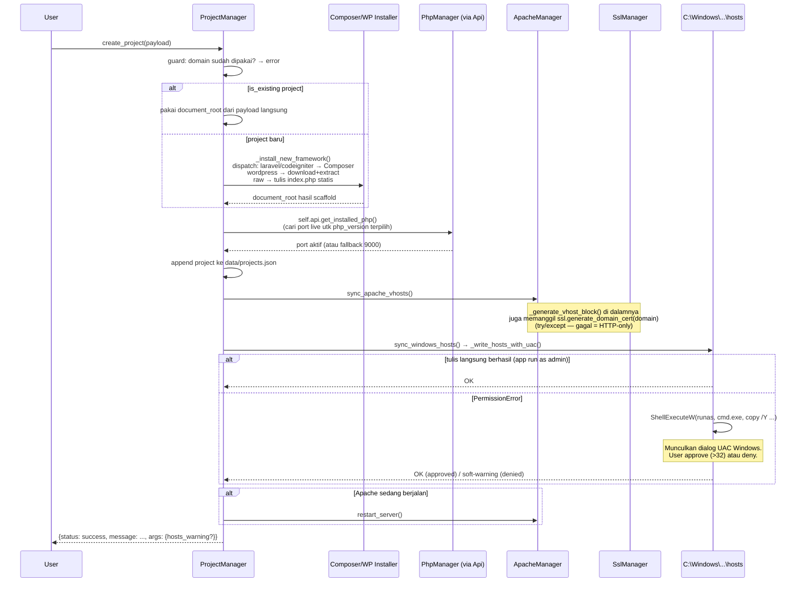

### 7.2 `_install_composer_framework()` — Detail Sub-Alur Scaffold

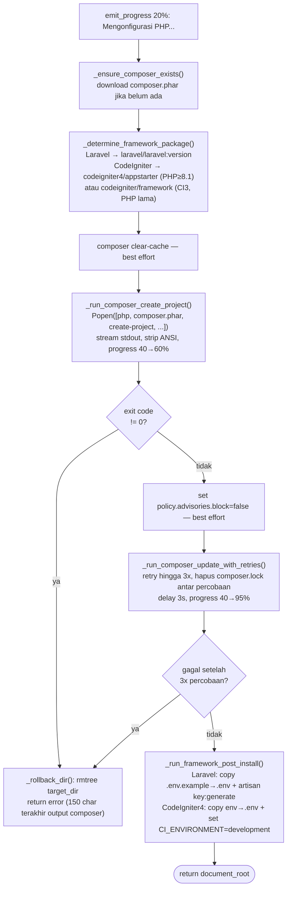

### 7.3 ✅ Bug Kritis (Sudah Diperbaiki): `sync_apache_vhosts()` Sempat Menulis ke Folder yang Salah

```python
# project.py — sync_apache_vhosts() — SEBELUM diperbaiki
extra_dir = os.path.join(status["path"], 'con', 'extra')   # ❌ SALAH: harusnya 'conf'

# SESUDAH diperbaiki
extra_dir = os.path.join(status["path"], 'conf', 'extra')  # ✅ BENAR
```

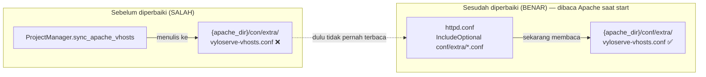

**Dampak sebelum diperbaiki:** Virtual host yang dibuat lewat `create_project`/`update_project`/`delete_project`, atau saat ganti versi Apache aktif, kemungkinan tidak pernah benar-benar termuat oleh Apache karena ditulis ke folder yang berbeda dari yang di-*include* `httpd.conf`. `docs/known_bugs.md` versi lama sempat salah mengklaim bug jenis ini ("conf" vs "con") sudah diperbaiki di seluruh proyek, padahal regresi ini masih ada di `project.py`. **Sudah dikoreksi ulang** pada audit ini — lihat §13 dan `docs/known_bugs.md` #3.

### 7.4 `delete_project(id, delete_files)` — Urutan Rollback Aman

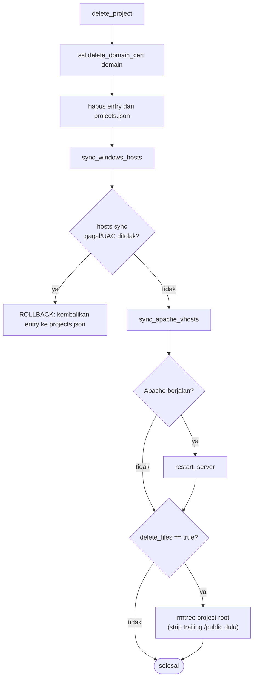

### 7.5 Ketergantungan Lintas-Service
`ProjectManager` adalah **konsumen terbesar** service lain: `ApacheManager` (sync vhost + restart), `SslManager` (cert per-domain), dan `Api.get_installed_php()` (resolusi port PHP aktif). Ia juga satu-satunya modul yang menyentuh file sistem Windows di luar direktori aplikasi (`C:\Windows\System32\drivers\etc\hosts`), sehingga satu-satunya sumber UAC prompt di aplikasi ini.

---

## 8. `RuntimesManager` (`runtimes_manager.py`)

Mengelola 4 runtime independen: Node.js, Python, Java (JDK), Go. Tidak bergantung service lain.

### 8.1 Deteksi Instalasi Eksternal (3 Lapis)

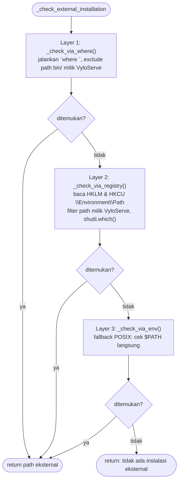

Hasil deteksi ini dipakai frontend untuk **mengunci toggle "Add to PATH"** jika runtime yang sama sudah terinstall secara native di sistem (mencegah konflik PATH) — lihat `docs/frontend_ui.md` §8.

### 8.2 Pola Install Generik (Node/Python/Java/Go)

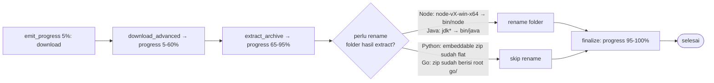

**Kekhususan per-engine:**
- **Node**: opsional jalankan `corepack.cmd enable` jika `enable_corepack=True` (dukungan Yarn/pnpm).
- **Python**: jika `install_pip=True` → patch file `._pth` (uncomment `import site`) → download `get-pip.py` → jalankan dengan env `SSL_CERT_FILE`/`REQUESTS_CA_BUNDLE` mengarah ke `certifi.where()` (Python embeddable tidak punya CA bundle bawaan) → hapus `get-pip.py`.
- **Java**: resolusi via Adoptium API (`api.adoptium.net/v3/binary/latest/...`).
- **Go**: jika versi diminta adalah string literal `"latest"`, resolusi dulu ke nomor versi nyata via `go.dev/dl/?mode=json`.

> ⚠️ **Kontrak `progress_cb` (penting, pernah jadi bug nyata):** callback `progress_cb`/`prog_cb` yang dikirim ke `download_advanced()`/`extract_archive()` (§3.1) selalu dipanggil dengan `pct` berupa **angka absolut 0-100** yang SUDAH dihitung internal oleh `file_utils.py` sendiri (mis. `10 + int(dl_percent * 0.5)` untuk unduhan, `65 + int((index/total)*15)` untuk ekstraksi ZIP) — **bukan** fraksi `0.0-1.0`. `_get_cbs(start_pct, end_pct)` di `RuntimesManager` **tidak mengalikan** `pct` dengan `span` (`start_pct + int(pct * span)` akan meluber ribuan persen, tepat itu yang terjadi di `docs/known_bugs.md` #16) — ia hanya meng-*clamp* `pct` ke `[start_pct, end_pct]` sebagai jaring pengaman. Rentang 5-60%/65-95% di diagram atas adalah **hasil clamp**, bukan hasil perkalian. Kalau menambah service baru yang memakai pola callback serupa, ikuti pola clamp ini, jangan pola kali-dengan-span.

### 8.3 PATH Toggle per Engine

| Engine | Path yang ditambahkan/dihapus | Ekstra |
|---|---|---|
| Node | `bin/node` | — |
| Python | `bin/python`, `bin/python/Scripts` | — |
| Java | `bin/java/bin` | **Juga set/hapus registry value `JAVA_HOME`** |
| Go | `bin/go/bin` | — |

Semua broadcast `WM_SETTINGCHANGE` setelah menulis registry (pola sama seperti `PhpManager.toggle_global_path`).

---

## 9. `GitManager` (`git_manager.py`)

Bentuk paling mirip `RuntimesManager`, dengan tambahan **lapis deteksi ke-4**: `_find_via_hardcoded()` — mengecek path instalasi umum (`%PROGRAMFILES%\Git\cmd\git.exe`, `%PROGRAMFILES(X86)%\...`, `%LOCALAPPDATA%\Programs\Git\cmd\git.exe`) sebagai upaya terakhir setelah `where` dan registry gagal.

**`install_git`**: mengunduh installer self-extracting `.7z.exe` dari rilis GitHub, lalu `_extract_sfx()` menjalankannya dengan flag `-y -o"{git_dir}"` (`shell=True`). ⚠️ **Tidak ada verifikasi checksum/signature** terhadap binary yang diunduh sebelum dieksekusi — pola risiko yang sama berlaku untuk semua unduhan binary di proyek ini (Apache, PHP, Node, Java, Go) — lihat §13.

**`get_git_config`/`set_git_config`**: wrapper `git config --global user.name/user.email`, dengan fallback ke `git` sistem jika PortableGit VyloServe belum terinstall.

---

## 10. `SslManager` (`ssl_manager.py`)

### 10.1 Dependency Kritis ke Apache
`_get_openssl_paths()` memanggil `self.api.apache.get_status()` dan **melempar `RuntimeError`** jika Apache belum terinstall — karena binary `openssl.exe` beserta `openssl.cnf` diambil dari dalam folder instalasi Apache, tidak ada OpenSSL independen.

### 10.2 Workflow: `generate_domain_cert(domain)`

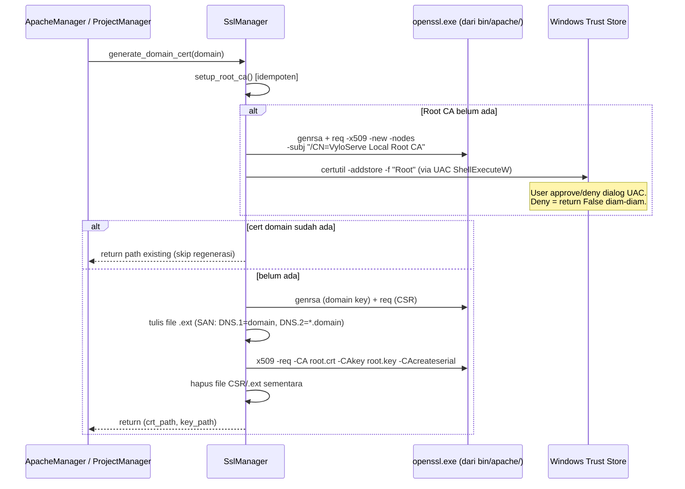

Dipanggil oleh `ApacheManager.update_global_php_proxy()` (untuk `localhost`) dan `ProjectManager._generate_vhost_block()` (per domain project) — keduanya membungkus panggilan ini dalam `try/except` dan diam-diam turun ke HTTP-only jika gagal.

---

## 11. `DashboardManager` & `SettingsManager`

Keduanya CRUD sederhana tanpa efek samping OS (tidak ada subprocess/registry/network).

| | `DashboardManager` | `SettingsManager` |
|---|---|---|
| File state | `data/dashboard.json` | `data/settings.json` |
| Isi | Toggle tampilan (`apache`/`php`/`database`), array `selected_php`/`selected_database` (dibaca oleh `PhpManager`/`DatabaseManager` untuk fitur "Start Selected") | `language`, `theme` (dapat diperluas) |
| **Semantik `save_config`/`save_settings`** | ⚠️ **Overwrite total** — frontend wajib kirim objek config lengkap, bukan partial patch | **Merge** — membaca dulu isi lama, hanya menimpa key yang dikirim |

> Perbedaan semantik ini penting untuk developer frontend: mengirim `save_dashboard_config({apache: true})` saja akan **menghapus** key lain yang sebelumnya ada (`php`, `database`, `selected_php`, dst), sedangkan `save_app_settings({language: "id"})` aman dikirim parsial.

---

## 12. `main.py` — App Bootstrap & `AppLifecycle`

> ✅ **Update:** `main.py` sebelumnya punya coverage 0% karena seluruh logic exit (`perform_exit`, `on_closing`) terjebak sebagai closure di dalam `if __name__ == '__main__':`, sehingga tidak bisa di-import untuk ditest. Sudah di-refactor menjadi class `AppLifecycle` — lihat detail di bawah.

### 12.1 Alur Bootstrap
1. `main()` membuat instance `Api()`, lalu `AppLifecycle(api, IS_PRODUCTION)`.
2. `webview.create_window(...)` membuat window → `api.set_window(window)` **dan** `lifecycle.set_window(window)` (keduanya perlu tahu window: `api` untuk `emit_log`/`emit_progress`, `lifecycle` untuk hide/destroy).
3. `api.quit_callback = lifecycle.perform_exit` — inilah yang membuat `Api.close_app()` (dipanggil dari tombol Quit UI) benar-benar memicu cleanup.
4. `window.events.closing += lifecycle.on_closing` — dipanggil setiap kali user menekan tombol (X).
5. Jika `IS_PRODUCTION`, `setup_systray(lifecycle, icon_path)` dipanggil untuk mengaktifkan ikon System Tray.
6. `webview.start(...)` — blocking call, baru return saat window benar-benar ditutup.

### 12.2 `AppLifecycle` — Satu Sumber Kebenaran untuk Exit/Hide

```mermaid
flowchart TD
    A["Trigger exit:<br/>Tombol Quit UI (api.close_app)<br/>ATAU Tray 'Exit Engine'"] --> B["lifecycle.perform_exit()"]
    B --> C[apache.stop_server try/except]
    C --> D[php.stop_all try/except]
    D --> E[database.stop_all try/except]
    E --> F{tray_icon di-set?}
    F -- ya --> G[tray_icon.stop try/except]
    F -- tidak --> H
    G --> H{window di-set?}
    H -- ya --> I[window.destroy try/except]
    H -- tidak --> J
    I --> J[os._exit(0)]

    K["Tombol (X) window<br/>window.events.closing"] --> L["lifecycle.on_closing()"]
    L --> M{is_production?}
    M -- tidak --> N["is_real_exit=True<br/>return True (destroy window)"]
    M -- ya --> O{is_real_exit sudah True?<br/>(dari perform_exit sebelumnya)}
    O -- tidak --> P["window.hide()<br/>return False (batalkan destroy)"]
    O -- ya --> Q["return True (destroy window)"]
```

**Kedua jalur exit (tombol Quit UI dan menu Tray "Exit Engine") kini memanggil `perform_exit()` yang sama** — sebelumnya menu Tray punya jalur pintas terpisah yang melewatkan cleanup engine (lihat `docs/known_bugs.md` #15).

### 12.3 Kenapa Diekstrak Jadi Class
`AppLifecycle` menyimpan `api`, `window`, `tray_icon`, `is_real_exit` sebagai atribut instance (bukan variabel global `is_real_exit`/`global_tray_icon` + closure seperti sebelumnya). Ini membuatnya bisa diinstansiasi langsung di unit test dengan `MagicMock()` sebagai pengganti `api`/`window`/`tray_icon`, tanpa perlu menjalankan `pywebview`/`webview.start()` sungguhan. Lihat `tests/test_main.py` untuk cakupan penuh (bootstrap, exit, hide-to-tray, system tray).

---

## 13. Known Issues — Temuan Audit Backend

Tabel ini adalah hasil audit langsung terhadap kode per tanggal dokumen ini ditulis. Status diperbarui secara jujur — beberapa klaim "sudah fixed" di dokumentasi sebelumnya **terbukti salah** saat kode benar-benar dibaca ulang.

| # | Temuan | Lokasi | Severity | Status |
|---|---|---|---|---|
| 1 | Typo `conf`→`con` — `sync_apache_vhosts()` menulis vhost ke folder yang tidak di-*include* `httpd.conf` | `core/services/project.py` (`sync_apache_vhosts`) | 🔴 Kritis — bug fungsional | ✅ **Sudah diperbaiki** — path diganti ke `conf/extra` |
| 2 | Proses child tidak dimatikan saat Quit — `main.py` `perform_exit()` tidak memanggil `apache.stop_server()`/`php.stop_all()`/`database.stop_all()` sebelum `os._exit(0)` | `main.py` (`perform_exit`) | 🔴 Kritis — bug fungsional | ✅ **Sudah diperbaiki** — ketiga fungsi stop dipanggil (masing-masing try/except) sebelum exit |
| 3 | `except Exception:` tanpa `as e` padahal mereferensikan `str(e)` → `NameError` menutupi error asli | `php.py.get_versions()`, `database.py._fetch_mariadb_versions()`, `database.py.open_path()` | 🟡 Sedang | ✅ **Sudah diperbaiki** — ketiganya jadi `except Exception as e:` |
| 4 | Klaim "`extract_archive()` mencegah zip slip" tidak akurat — tidak ada validasi path traversal di kode | `core/utils/file_utils.py` | 🟡 Dokumentasi tidak akurat + hardening | ✅ **Sudah diperbaiki** — ditambahkan `_is_safe_extract_path()`, diterapkan ke `_extract_zip` & `_extract_tar_gz` |
| 5 | Tidak ada verifikasi checksum/signature pada binary yang diunduh (Apache, PHP, Node, Python, Java, Go, Git) | Semua `install_*`/`install_version` di `core/services/*.py` | 🟢 Rendah (semua URL fixed ke vendor resmi) | Belum diperbaiki — hardening opsional, lihat `docs/known_bugs.md` #8 untuk alasan tidak diotomasi sekarang |
| 6 | `PROJECT_NOT_LOADED_MSG` direferensikan tapi tidak pernah didefinisikan | `core/api.py` (`get_projects`, `delete_project`, dll) | 🟢 Rendah (dead code saat ini) | ✅ **Sudah diperbaiki** — konstanta didefinisikan + translation key ditambahkan ke `en`/`id` |
| 7 | Endpoint `close_app()`, `open_db_config_file()`, `open_db_dir()`, `get_available_python_versions()`, dll belum masuk peta API | Dokumentasi | 🟢 Gap dokumentasi | ✅ Ditambahkan ke `ai_development_guide.md` |
| 8 | Urutan `stop_database()` (hard-kill dulu, graceful-shutdown belakangan sebagai fallback) terbalik dari konvensi umum | `database.py.stop_database()` | 🟢 Perilaku desain, bukan bug | Dicatat, tidak diubah kecuali ada laporan data corruption |
| 9 | Event `vylo_progress` bocor lintas modul frontend (semua halaman selalu mounted, tidak ada filter sumber) | `core/api.py` + semua `menu/*/Main.tsx` yang listen `vylo_progress` | 🟡 Sedang — UX membingungkan | ✅ **Sudah diperbaiki** — `emit_log`/`emit_progress` auto-deteksi `source` via `inspect`, listener frontend memfilter berdasarkan `source` |
| 10 | Migrasi legacy `apache_active_version.txt` selalu gagal diam-diam di Windows (`os.remove()` dipanggil saat file masih terbuka → `PermissionError` tertelan) | `apache.py._get_active_version()` | 🟡 Sedang — fitur migrasi tidak pernah benar-benar jalan | ✅ **Sudah diperbaiki** — `os.remove()` dipindah ke luar blok `with` |
| 11 | `uninstall_go()` tidak punya `return` sama sekali (implisit `None`) — frontend salah menampilkan error walau sukses | `runtimes_manager.py.uninstall_go()` | 🟡 Sedang — bug fungsional UX | ✅ **Sudah diperbaiki** — ditambahkan `return {"status": "success"}` |
| 12 | `install_java()`/`install_go()` hanya menangkap `except OSError`, melewatkan `RuntimeError` yang dilempar sendiri di dalam try-nya → crash tidak tertangkap | `runtimes_manager.py` | 🔴 Bisa crash saat folder JDK tidak ditemukan setelah ekstrak | ✅ **Sudah diperbaiki** — diubah jadi `except Exception as e:`, konsisten dengan `install_node`/`install_python` |
| 13 | Menu Tray "Exit Engine" punya jalur exit terpisah yang melewatkan cleanup engine (Apache/PHP/Database) — bug #2 sebenarnya masih bisa terjadi lewat jalur ini | `main.py` (`setup_systray.on_exit_clicked`, sebelum refactor) | 🔴 Kritis — bug fungsional (zombie process via jalur lain) | ✅ **Sudah diperbaiki** — kini memanggil `lifecycle.perform_exit()` yang sama dengan tombol Quit UI, sekaligus bagian dari refactor `main.py` → `AppLifecycle` (§12) |
| 14 | `_get_cbs()`'s `download_cb` memperlakukan `pct` (absolut 0-100 dari `file_utils.py`) seolah fraksi `0.0-1.0`, mengalikannya dengan `span` → progress meluber ribuan persen saat unduhan/ekstraksi, lalu "melompat mundur" saat tahap berikutnya mengirim nilai tetap | `runtimes_manager.py._get_cbs()`, `git_manager.py.install_git()` (multiplier lebih kecil, gejala tersamar) | 🔴 Kritis — bug UX nyata, dilaporkan pengguna | ✅ **Sudah diperbaiki** — `download_cb` sekarang meng-*clamp* `pct` ke `[start_pct, end_pct]`, bukan mengalikan. Lihat §8.2 & `docs/known_bugs.md` #16 |
| 15 | `read_json(path, dict).get(...)` dipanggil langsung tanpa `isinstance` check di 2 tempat — crash `AttributeError: 'str' object has no attribute 'get'` jika file JSON valid tapi bukan objek | `php.py._get_preferred_versions()`, `database.py._get_preferred_dbs()` | 🔴 Kritis — crash tidak konsisten (tergantung isi file saat itu) | ✅ **Sudah diperbaiki** — root cause di `read_json()` sendiri (§3.1, sekarang menjamin tipe), plus `isinstance` guard eksplisit di kedua caller. Lihat `docs/known_bugs.md` #17 |
| 16 | Tahap "configuring" pada `install_version()` PHP melapor progress **100%** padahal Composer (tahap berikutnya) belum dipasang → melanggar kontrak `percent>=100 = selesai` (§2.2) → widget progress frontend menghilang mid-instalasi | `php.py.install_version()` | 🔴 Kritis — bug UX nyata, dilaporkan pengguna | ✅ **Sudah diperbaiki** — diganti jadi 92%; 100% dicadangkan khusus untuk `"backend.php.installation_complete"`. Lihat `docs/known_bugs.md` #18 |

> Lihat `docs/known_bugs.md` untuk detail lengkap tiap perbaikan (#3, #6–#18 di dokumen tersebut berkorespondensi dengan tabel di atas).
