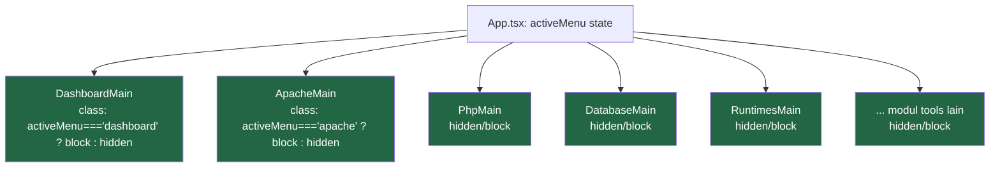
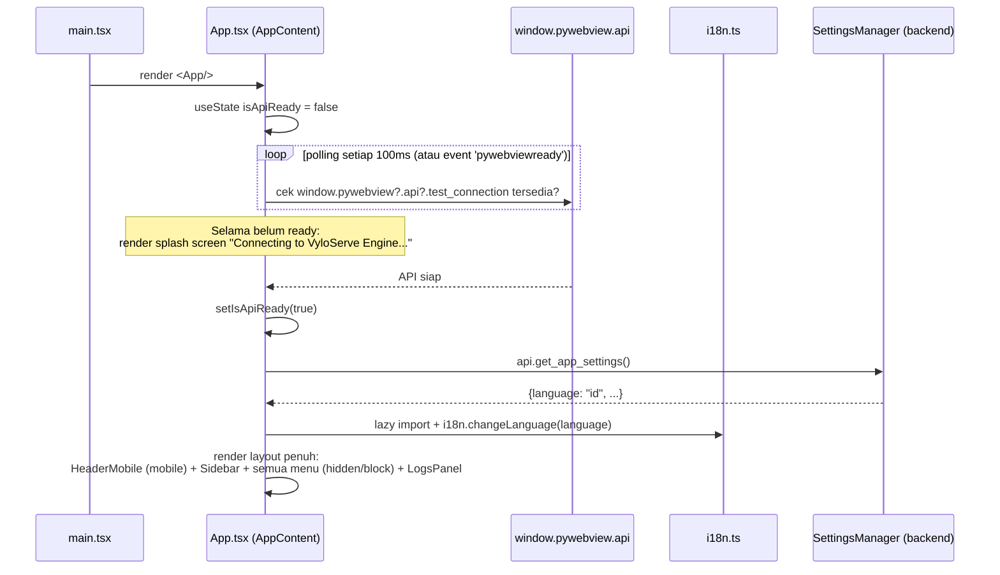
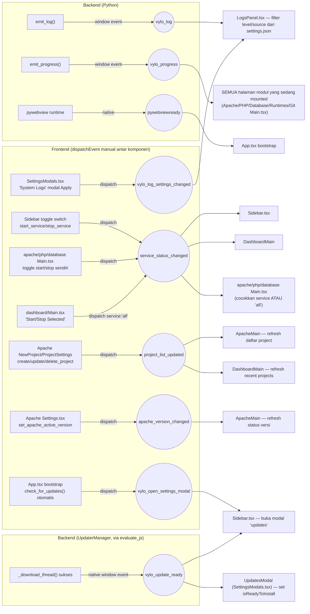
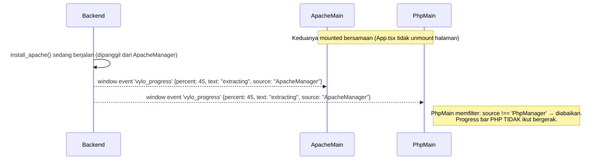
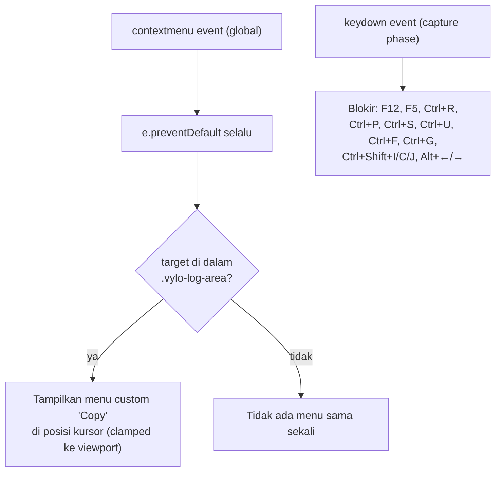
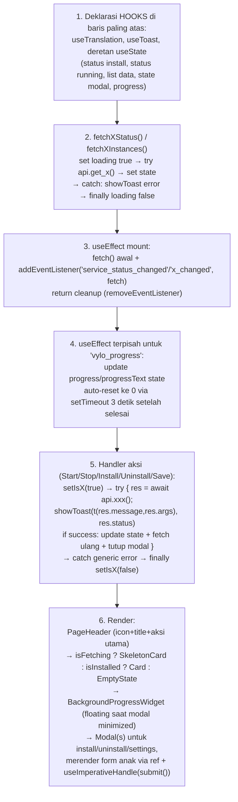
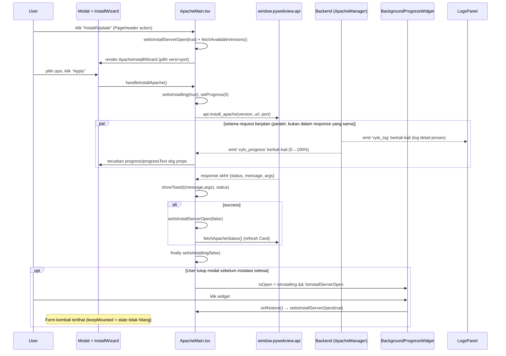
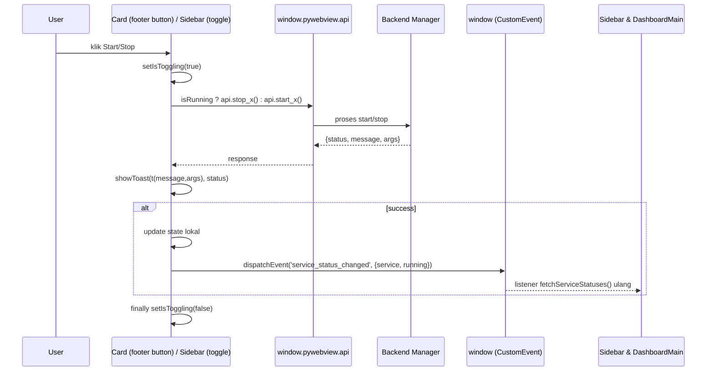
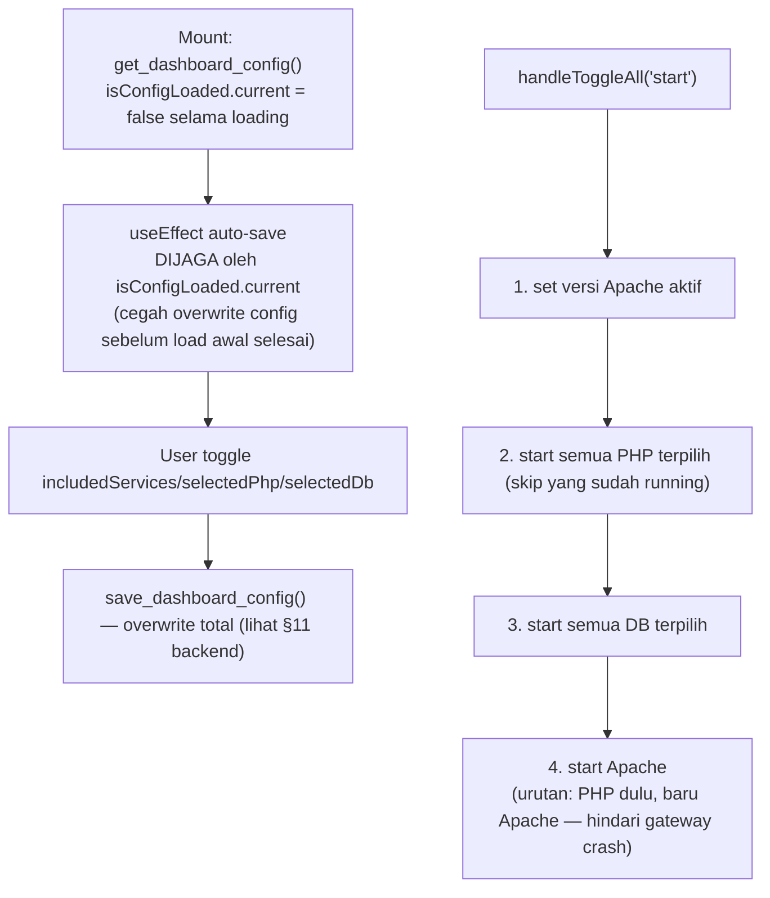

# Frontend & Antarmuka (React UI) — Dokumentasi Mendalam

> **Metodologi dokumen ini:** Ditulis berdasarkan audit langsung terhadap seluruh isi `frontend/src/` (bukan asumsi dari dokumentasi sebelumnya). Struktur folder di bawah ini adalah **struktur nyata saat ini** — dokumentasi versi lama menyebutkan folder `contexts/` dan `components/ui/` yang **tidak ada** di kode, serta menyiratkan routing berbasis React Router yang **juga tidak digunakan**. Semua perbedaan ini dicatat di [§12](#12-known-issues--ketidaksesuaian-dengan-dokumentasi-lama).
>
> Setiap alur kerja (bootstrap aplikasi, install service, toggle start/stop, event bus global) disertai diagram Mermaid yang menggambarkan urutan nyata di kode.

---

## Daftar Isi

1. [Struktur Direktori Aktual](#1-struktur-direktori-aktual)
2. [Sistem Desain & Palet Warna (Design System)](#2-sistem-desain--palet-warna-design-system)
3. [Struktur Komponen Berbasis Atomic Design](#3-struktur-komponen-berbasis-atomic-design)
4. [Routing & Layout Global (`App.tsx`)](#4-routing--layout-global-apptsx)
5. [Global Event Bus — Mekanisme Komunikasi Antar Komponen](#5-global-event-bus--mekanisme-komunikasi-antar-komponen)
6. [Provider & Komponen Cross-Cutting](#6-provider--komponen-cross-cutting)
7. [Anatomi Halaman "Golden Standard"](#7-anatomi-halaman-golden-standard)
8. [Sequence Diagram: Alur Install Service](#8-sequence-diagram-alur-install-service)
9. [Sequence Diagram: Alur Toggle Start/Stop](#9-sequence-diagram-alur-toggle-startstop)
10. [Modul: Apache](#10-modul-apache)
11. [Modul: PHP](#11-modul-php)
12. [Modul: Database](#12-modul-database)
13. [Modul: Dashboard](#13-modul-dashboard)
14. [Modul: Runtimes & Tools](#14-modul-runtimes--tools)
15. [Sistem i18n (Terjemahan)](#15-sistem-i18n-terjemahan)
16. [Known Issues — Ketidaksesuaian dengan Dokumentasi Lama](#16-known-issues--ketidaksesuaian-dengan-dokumentasi-lama)
17. [Styling: Tailwind CSS v4, Cascade Layers & Ikon Material Symbols](#17-styling-tailwind-css-v4-cascade-layers--ikon-material-symbols)

---
## 1. Struktur Direktori Aktual

```text
frontend/src/
├── App.tsx                      # Root komponen — routing MANUAL via useState, BUKAN react-router
├── main.tsx                     # Entry point (createRoot)
├── i18n.ts                      # Konfigurasi react-i18next (bukan "TranslationContext")
├── index.css
├── components/                  # FLAT — tidak ada subfolder ui/
│   ├── AppInterceptor.tsx       # export default GlobalAppInterceptor
│   ├── BackgroundProgressWidget.tsx
│   ├── Card.tsx
│   ├── EmptyState.tsx
│   ├── HeaderMobile.tsx
│   ├── LogsPanel.tsx
│   ├── Modal.tsx
│   ├── PageHeader.tsx
│   ├── Sidebar.tsx
│   ├── SkeletonCard.tsx
│   └── ToastContext.tsx
├── menu/
│   ├── apache/     Main.tsx, NewProject.tsx, ProjectSettings.tsx, Settings.tsx, InstallWizard.tsx
│   ├── php/        Main.tsx, NewInstance.tsx, Settings.tsx
│   ├── database/   Main.tsx, NewInstance.tsx, Settings.tsx, ChangePassword.tsx
│   ├── dashboard/  Main.tsx
│   ├── runtimes/   Main.tsx, InstallNode.tsx, InstallPython.tsx, InstallJava.tsx, InstallGo.tsx, RuntimeVersionSelect.tsx
│   └── tools/
│       ├── git/Main.tsx
│       ├── base64-encode-decode/Main.tsx
│       ├── url-encode-decode/Main.tsx
│       ├── qr-generator/Main.tsx
│       └── settings/SettingsModals.tsx
├── utils/                        # Helper murni (BUKAN komponen React), tidak punya state/hook sendiri
│   ├── a11y.ts                  # onEnterOrSpace(handler) — keyboard support (Enter/Space) utk elemen
│   │                             # non-native yang diberi role ARIA (mis. listbox custom)
│   └── progress.ts              # clampPercent(value) — clamp hasil event `vylo_progress` ke [0, 100]
│                                 # sebagai pengaman sisi frontend, lihat §3.3
└── locales/{en,id}/translation.json
```

> ❌ **Tidak ada** di kode (meski disebut dokumentasi lama): folder `contexts/`, folder `components/ui/`, folder `menu/project/`. Manajemen Virtual Host/Project sepenuhnya berada di dalam `menu/apache/` (`NewProject.tsx`, `ProjectSettings.tsx`), bukan modul terpisah.

---

## 2. Sistem Desain & Palet Warna (Design System)

VyloServe menerapkan antarmuka **Dark Mode murni** modern (tanpa light mode) yang memanfaatkan integrasi warna *slate* (abu-abu kebiruan) untuk memberikan kesan profesional seperti alat-alat *developer/server management* pada umumnya.

### Palet Warna Utama (Tailwind CSS)

| Peran Warna | Kode Tailwind | Kode HEX | Penggunaan Utama |
|---|---|---|---|
| **Background Aplikasi** | `bg-slate-900` | `#0f172a` | Warna dasar kanvas jendela aplikasi utama (sesuai *background_color* `main.py`). |
| **Surface & Card** | `bg-slate-800` | `#1e293b` | Elemen melayang seperti Sidebar, Header, Modal, dan Container Card. |
| **Elevated Surface** | `bg-slate-700` | `#334155` | Elemen interaktif saat di-hover, *border*, atau pemisah (*divider*). |
| **Primary Accent (Aksi/Aktif)**| `bg-emerald-600` / `500` | `#059669` / `#10b981` | Tombol primer ("Install", "Save"), Toggle aktif (seperti `ToggleSwitch`), indikator status "Running/Active". |
| **Danger / Error** | `bg-red-500` | `#ef4444` | Tombol destruktif ("Delete", "Stop"), Indikator status "Error/Offline". |
| **Warning / Perhatian** | `text-amber-500` | `#f59e0b` | Log warning, *banner* peringatan konflik *port* atau ekstensi. |
| **Info / System** | `text-blue-500` | `#3b82f6` | Teks informasional dan lencana penanda komponen sistem bawaan OS (*Native/System*). |
| **Teks Utama (Primary)** | `text-slate-100` | `#f1f5f9` | Judul halaman, teks tombol utama, nilai konfigurasi. |
| **Teks Sekunder (Muted)** | `text-slate-400` | `#94a3b8` | Deskripsi tambahan, teks pembantu (*help text*), placeholder *input*. |

### Tata Letak (Layout) & Gaya (Style)
- **Spasial & Bentuk:** Menggunakan sudut melengkung moderat (`rounded-lg` / `rounded-xl`) dengan drop shadow halus (`shadow-md`, `shadow-lg`) untuk memberi kedalaman pada Modal dan *Card*.
- **Tipografi:** Menggunakan font *sans-serif* bawaan sistem OS (standar Tailwind) agar *render* UI terasa natif di Windows.
- **Ikonografi:** Sepenuhnya ditenagai oleh **Material Symbols Outlined** yang dikendalikan proporsinya via utility class `text-[Npx]`.

---

## 3. Struktur Komponen Berbasis *Atomic Design*

Arsitektur *frontend* di proyek ini mematuhi paradigma **Atomic Design**, yang mengurai kompleksitas UI ke dalam 5 lapisan komposisional:

### 1. Atoms (Atom)
Elemen antarmuka terkecil dan paling dasar, yang tidak dapat dipecah lagi. Atom di proyek ini sering di-*render* langsung lewat kelas Tailwind.
- **`ToggleSwitch`**: Komponen pill kecil `w-8 h-4` untuk sakelar On/Off (digunakan di setelan log dan sidebar).
- **Tombol (Buttons)**: Tombol standar (Primer hijau, Sekunder abu-abu, Destruktif merah).
- **Ikon**: `<span className="material-symbols-outlined">...</span>`.
- **Elemen Form Dasar**: `<input>`, `<select>` yang telah dibumbui class Tailwind (*ring*, *outline-none*).

### 2. Molecules (Molekul)
Kumpulan Atom yang disatukan menjadi komponen UI sederhana dengan 1 fungsi spesifik.
- **`PageHeader.tsx`**: Menyatukan judul teks (Atom) dan sub-deskripsi (Atom) atau tombol aksi di ujung kanan.
- **`SkeletonCard.tsx`**: Molekul *loading state* pengganti Card sebelum data tersedia.
- **Form Fields (Pasangan Label + Input)**: Penggabungan `<label>` dengan *accessibility* `htmlFor` dan `<input>` ber-id sama (kewajiban standar *accessibility* VyloServe).

### 3. Organisms (Organisme)
Gabungan dari Molekul dan Atom yang membentuk satu bagian (blok) UI kompleks dan memiliki konteks bisnis mandiri.
- **`Card.tsx`**: Organisme standar pembungkus modul (menyatukan Molekul header Card, Atom tombol aksi, dan lencana status *auto-theming* warna berdasar status "running/error").
- **`Modal.tsx`**: Komponen kontainer dialog *popup* terpusat dengan *backdrop* gelap.
- **`LogsPanel.tsx` / `UpdatesModal.tsx`**: Organisme super-kompleks dengan berbagai *state internal*, tab filter, dan mekanisme *event listener*.

### 4. Templates (Templat)
Pola tata letak layar ("Golden Standard") yang belum diisi data nyata, mengatur susunan letak Organisme di dalam halaman.
- **Golden Standard Module Template**: Pola `PageHeader + SkeletonCard + EmptyState + (Mapping n-Card)`. Dipakai secara seragam oleh seluruh modul (Apache, PHP, Database, Runtimes, Git). 

### 5. Pages (Halaman / Layar)
Implementasi dari Template dengan memuat data (Logika Bisnis/State) dari *Backend API* dan memberikan konteks utuh. Ini adalah file-file `Main.tsx` di dalam folder `src/menu/`.
- `Apache/Main.tsx`, `Php/Main.tsx`, `Database/Main.tsx`.

---

## 6. Routing & Layout Global (`App.tsx`)

### 2.1 Routing Manual (Bukan React Router)

`activeMenu` adalah `useState<string>` (default `'dashboard'`) yang menentukan halaman aktif. Nilai valid: `dashboard, apache, php, database, runtimes, git, url-encode-decode, base64, qr`.

**Implikasi penting:** Navigasi `Sidebar.tsx` hanyalah `onSelectMenu(id) → setActiveMenu(id)` — tidak ada URL/history, tidak bisa back/forward browser (memang sengaja diblokir juga oleh `AppInterceptor`, lihat §4.2).

### 2.2 ⚠️ Semua Halaman Selalu Ter-mount Sekaligus



Semua modul di-render **sekaligus** dan disembunyikan lewat CSS class kondisional (`hidden`/`block`), **bukan** conditional render (`{cond && <X/>}`). Konsekuensi:
- **State internal setiap halaman tetap hidup** walau tidak sedang dilihat user.
- `setInterval` polling (mis. status PHP/Database tiap beberapa detik) **tetap berjalan di background** meski user sedang berada di tab lain — berdampak ke pemakaian resource kecil tapi konstan.
- Event listener tiap halaman (`vylo_progress`, dll) tetap aktif walau halaman tidak terlihat — ini adalah akar penyebab bug event-bleed yang dijelaskan di §3.3.

### 2.3 Sequence Diagram: Bootstrap Aplikasi



### 2.4 `Sidebar.tsx`

- 3 grup menu hardcoded: `MAIN_MENU` (dashboard), `SERVICES` (apache/php/database/runtimes), `TOOLS` (qr/base64/url-encode-decode/git dalam dropdown collapsible).
- **Dipecah jadi sub-komponen** (pola sama dengan `ApacheStatusSection`/`ApacheProjectCard` di `apache/Main.tsx`, lihat §5.1): `SidebarHeader`, `ServiceNavItem`, `ToolsNavItem`, `SidebarFooter` — masing-masing fungsi terpisah di file yang sama, menerima data lewat props, dirender dari `Sidebar()`. Awalnya seluruh JSX ditulis inline di satu fungsi `Sidebar()` dan Cognitive Complexity-nya menembus 19 (batas SonarQube 15) karena akumulasi percabangan `isDesktopCollapsed` di banyak blok berbeda; ekstraksi ini menurunkannya tanpa mengubah perilaku (setiap sub-komponen dipindah verbatim, cuma dibungkus fungsi + props). Kalau menambah percabangan baru ke salah satu blok ini, pertimbangkan dulu apakah blok itu masih pantas tetap di `Sidebar()` langsung atau perlu diekstrak lagi.
- **Toggle switch di tiap Service card** memanggil endpoint generik `api.start_service(id)`/`api.stop_service(id)` (bukan `start_apache_server()` spesifik) → sukses → `dispatchEvent('service_status_changed', {detail: {service, running}})` agar Dashboard & halaman modul lain ikut sinkron tanpa saling mengimpor state.
- Polling mandiri tiap 2 detik: `api.get_all_services_status()` → isi badge status tiap service + CPU% di footer sidebar.
- Search bar filter live berdasarkan nama menu ter-translate.
- **Mode collapsed (`isDesktopCollapsed`, ikon-rail 80px)** — konvensi yang harus diikuti kalau menambah item nav baru:
  - Elemen yang cuma perlu "disembunyikan visual saat collapsed" (label teks, dsb) boleh pakai class Tailwind (`max-w-0 opacity-0`/`hidden`) karena animasinya butuh transisi width/opacity.
  - Elemen indikator interaktif (mis. panah dropdown "Tools") **WAJIB** di-conditional-render (`{!isDesktopCollapsed && (...)}`), **BUKAN** cuma diberi class `hidden` — pernah ada bug nyata di mana class `hidden` tampak benar di kode tapi elemennya masih terlihat karena tertimpa bug CSS lain (lihat `docs/known_bugs.md` #20) sehingga sulit dibedakan mana yang benar-benar bug dan mana efek samping; conditional-render menghapus elemen dari DOM sepenuhnya, jadi tidak ambigu.
  - Item nav yang punya flyout submenu (pola "Tools") menandai keberadaan submenu lewat **ikon `chevron_right` di sebelah ikon utama, ukuran SAMA** (kedua ikon `style={{ fontSize: '18px' }}`, `ml-0.5` di antaranya, `gap-0` pada container supaya total lebar `18+2+18=38px` muat dalam ~40px ruang konten rail) — **bukan** badge kecil menumpuk di sudut ikon (pola lama, terlihat seperti "ikon kecil nyasar di bawah", sudah diganti karena sulit dibaca sebagai penanda submenu).
  - Header collapsed **hanya menampilkan tombol toggle** (`menu_open`, di-mirror `scale-x-[-1]` supaya panahnya mengarah ke kanan/"expand"), logo aplikasi **disembunyikan total** saat collapsed (bukan diganti versi icon-only). Keputusan desain (lihat diskusi UI/UX terkait): logo tidak clickable/tidak fungsional saat collapsed, sementara tombol toggle adalah satu-satunya kontrol untuk kembali ke expanded — di ruang rail 80px yang sempit, prioritaskan elemen fungsional (Fitts's Law) daripada elemen dekoratif; efek sampingnya, dengan cuma 1 elemen tersisa, ikon toggle otomatis center tanpa perlu extra layout trick.
  - Item nav yang **tidak punya kontrol start/stop yang valid** di backend (mis. `runtimes` — tidak ada endpoint `start_service`/`stop_service('runtimes')` di `core/api.py`, jadi toggle switch di baris itu dulu selalu gagal diam-diam) **WAJIB** ditandai `hasToggle: false` di array `SERVICES`, bukan tetap menampilkan toggle yang tidak pernah berfungsi. Toggle switch di render dibungkus `{service.hasToggle && (...)}`.
- **Item menu "Updates"** di `SidebarFooter` (antara "System Logs" dan "About") membuka modal `updates` (`onOpenModal('updates')` → `activeSettingsModal` di `Sidebar.tsx`). Selain klik manual, modal ini juga bisa terbuka **otomatis** lewat dua listener `window` yang dipasang di `Sidebar.tsx`: `vylo_open_settings_modal` (dipicu `App.tsx` saat auto-check update di startup menemukan versi baru — lihat §3.1) dan `vylo_update_ready` (dipicu backend `UpdaterManager` lewat `evaluate_js` setelah download selesai, agar user diarahkan langsung ke tombol install walau modalnya sudah tertutup saat download berjalan). Lihat `docs/backend_services.md` §12 untuk sisi backend fitur Auto-Updater ini.

### 2.5 `HeaderMobile.tsx`
Header untuk layar mobile (`md:hidden`) — tombol hamburger memicu `onMenuClick` dari `App.tsx` untuk membuka overlay sidebar.

---

## 5. Global Event Bus — Mekanisme Komunikasi Antar Komponen

VyloServe **tidak memakai Redux/Zustand/Context global untuk state lintas-komponen** — sebagai gantinya, komunikasi antar komponen yang tidak punya hubungan parent-child memakai **native browser `CustomEvent` di level `window`**. Ini adalah mekanisme paling penting untuk dipahami sebelum menambah fitur baru.

### 3.1 Peta Lengkap Event



| Event | Emitter | Listener | Payload |
|---|---|---|---|
| `vylo_log` | Backend `emit_log()` — dipanggil langsung di titik-titik kode tertentu (install, error, dsb., `source` auto-detect nama class) **dan** otomatis secara berkala oleh `Api`'s log watcher thread (`ApacheManager`/`DatabaseManager.tail_new_logs()`, tiap 2 detik, lihat `docs/backend_services.md` §11.2) yang menyalurkan baris baru di `error_log`/`access_log`/`db_startup.log`/`*.err` dengan `source` di-*override* eksplisit jadi `'ApacheFileLog'`/`'DatabaseFileLog'` — **kategori terpisah** dari pesan sistem `'ApacheManager'`/`'DatabaseManager'` biasa, supaya bisa difilter independen (lihat `docs/known_bugs.md` #26) | `LogsPanel.tsx` — **memfilter** berdasarkan `level`/`source` sesuai preferensi tersimpan di `data/settings.json` (`system_log_levels`/`system_log_sources`, diatur lewat modal "System Logs" — gear icon di Sidebar). `null`/tidak ada = belum dikustomisasi, tampilkan semua; array APAPUN (termasuk array kosong) = daftar eksplisit tersimpan, dipakai apa adanya — **bukan** array kosong berarti "tampilkan semua" (itu bug lama, lihat `docs/known_bugs.md` #26). Buffer dibatasi 500 entri terakhir (`MAX_LOG_ENTRIES`) agar tidak tumbuh tanpa batas di sesi panjang. | `{message, level, args, source}` |
| `vylo_progress` | Backend `emit_progress()` | Halaman modul yang sedang *mounted* — kini **memfilter berdasarkan `source`** (lihat §3.3) | `{percent, text, args, source}` |
| `pywebviewready` | Runtime pywebview (native) | `App.tsx` (bootstrap) | — |
| `service_status_changed` | `Sidebar.tsx` toggle switch, toggle start/stop di `apache/php/database Main.tsx` masing-masing, `dashboard/Main.tsx` "Start/Stop Selected" (`service: 'all'`) | `Sidebar.tsx` (self-refresh), `DashboardMain`, dan `apache/php/database Main.tsx` (masing-masing mencocokkan `e.detail.service` terhadap namanya sendiri ATAU `'all'`) | `{service, running?}` — **wajib** selalu sertakan `detail.service`; dispatch tanpa `detail` pernah jadi bug nyata, lihat `docs/known_bugs.md` #22 |
| `project_list_updated` | `NewProject.tsx`, `ProjectSettings.tsx` (Apache) | `ApacheMain.tsx`, `DashboardMain` (refresh recent projects — lihat `docs/known_bugs.md` #23) | — |
| `apache_version_changed` | `Settings.tsx` (Apache) | `ApacheMain.tsx` | — |
| `vylo_log_settings_changed` | Modal "System Logs" (`SettingsModals.tsx`) setelah "Save" | `LogsPanel.tsx` (re-fetch preferensi filter tanpa perlu remount) | — |
| `vylo_open_settings_modal` | `App.tsx` bootstrap — setelah `get_app_settings()` sukses, memanggil `check_for_updates()` di latar belakang; jika `is_update_available: true`, dispatch event ini | `Sidebar.tsx` — set `activeSettingsModal` sesuai `detail.modal` (saat ini selalu `'updates'`) sehingga modal Auto-Updater terbuka otomatis tanpa user perlu klik menu | `{modal: 'updates'}` |
| `vylo_update_ready` | Backend `UpdaterManager._download_thread()` lewat `window.evaluate_js()` langsung (bukan lewat `emit_progress`/`emit_log`, karena ini bukan pesan log melainkan sinyal state selesai) setelah file installer selesai diunduh | `Sidebar.tsx` (buka modal `updates` kalau belum terbuka) **dan** `UpdatesModal` sendiri kalau modalnya sudah terbuka (refresh `get_update_status()`, set `isReadyToInstall=true`) | — |

### 3.2 Kontrak Toast: `showToast` Menerima String yang Sudah Diterjemahkan

Konvensi ketat di seluruh codebase: pemanggil **wajib** memanggil `t(res.message, res.args)` dulu sebelum melempar ke `showToast(...)`. `ToastContext` sendiri tidak tahu apa-apa soal i18n.

```typescript
// Pola yang SELALU dipakai di semua handler:
const res = await api.some_action();
showToast(t(res.message, res.args || {}), res.status === 'success' ? 'success' : 'error');
```

### 3.3 ✅ Bug Ditemukan & Diperbaiki: Event `vylo_progress` "Bocor" Lintas Modul

Karena **semua halaman modul selalu ter-mount** (§2.2) dan **setiap halaman memasang listener `vylo_progress` sendiri**, progress bar dari instalasi Apache sebelumnya bisa ikut ter-*update* di komponen PHP jika modal PHP kebetulan sedang terbuka pada saat yang sama — payload event tidak punya field untuk membedakan progress milik modul mana.



**Solusi yang sudah diterapkan:**
- **Backend** (`core/api.py`): `emit_log()`/`emit_progress()` memakai `inspect.currentframe()` untuk otomatis mendeteksi nama class Manager pemanggil (`self.__class__.__name__`) dan menyertakannya sebagai field `source` di payload — **tanpa perlu mengubah satu-per-satu titik panggilan** `emit_progress(...)` yang tersebar di seluruh `core/services/*.py`.
- **Frontend**: setiap listener `vylo_progress` (`ApacheMain`, `NewProject` Apache, `PhpMain`, `PhpNewInstance`, `DatabaseMain`, `RuntimesMain`, Git `Main`) memfilter `e.detail.source` terhadap nama Manager yang relevan sebelum meng-update state progress. `ApacheMain` menerima dua sumber (`ApacheManager` dan `ProjectManager`) karena satu halaman itu menampilkan progress untuk instalasi Apache maupun pembuatan project baru.
- Sebagai bagian dari perbaikan ini, 4 titik di `core/services/project.py` yang sebelumnya memanggil `window.evaluate_js()` secara manual (bypass `emit_progress`, dengan escaping string manual yang rawan) diubah memakai `self._progress()` sehingga otomatis ikut mendapat `source` yang benar sekaligus escaping JSON yang aman (`json.dumps`).

### 3.4 ⚠️ Kontrak Implisit: `percent >= 100` / `percent <= 0` = "Proses Selesai"

Field `percent` di payload `vylo_progress` **selalu berupa angka absolut 0-100** (bukan fraksi 0.0-1.0 — lihat `docs/backend_services.md` §"Kontrak `progress_cb`"). Di sisi frontend, nilai ini punya **makna tersembunyi tambahan** yang tidak eksplisit di payload event itu sendiri: listener di `apache/Main.tsx`, `php/Main.tsx`, dan `database/Main.tsx` memperlakukan **`percent >= 100` atau `percent <= 0` sebagai sinyal "proses benar-benar selesai"**, lalu menjadwalkan `setTimeout(..., 3000)` untuk auto-reset `progress` ke 0 (menyembunyikan `BackgroundProgressWidget`, lihat §4.4).

Kontrak ini rawan dilanggar dari sisi backend: sebuah service **tidak boleh** memanggil `_progress(100, ...)`/`emit_progress(100, ...)` untuk *checkpoint* di tengah alur multi-tahap (mis. "konfigurasi selesai, lanjut ke tahap berikutnya") — 100% harus benar-benar berarti "tidak ada lagi yang akan terjadi". Pelanggaran kontrak ini pernah terjadi di `PhpManager.install_version()` (tahap "configuring" sempat melapor 100% sebelum instalasi Composer dimulai) dan menyebabkan `BackgroundProgressWidget` menghilang mid-instalasi — lihat `docs/known_bugs.md` #18 untuk kronologi lengkap dan perbaikannya.

Sebagai pengaman tambahan di sisi frontend (karena kontrak di atas bergantung pada disiplin setiap service backend dan bisa dilanggar lagi di masa depan), ketiga listener tersebut sekarang membatalkan (`clearTimeout`) timer auto-hide yang masih pending setiap kali ada event `vylo_progress` baru, sebelum menjadwalkan timer baru. Ini mencegah timer basi dari event 100%/0% yang ternyata bukan akhir proses menyembunyikan widget saat proses backend masih berjalan.

---

## 6. Provider & Komponen Cross-Cutting

### 4.1 `ToastContext.tsx`
Context + Provider standar. `useToast()` → `showToast(message, type)`. 4 tipe (`success|error|warning|info`), auto-hilang 4000ms, container `fixed bottom-6 right-6`. **Menerima string yang sudah diterjemahkan** (lihat §3.2) — tidak terhubung langsung ke sistem i18n.

### 4.2 `AppInterceptor.tsx` (`export default GlobalAppInterceptor`)



Klik di mana saja menutup context menu custom. Copy handler pakai `navigator.clipboard.writeText` dengan fallback try/catch + toast.

### 4.3 `LogsPanel.tsx`
Panel log **fixed di bawah layout**, collapsible & resizable (drag strip 1.5px, clamp 100px–80% tinggi viewport). Listener: `window.addEventListener('vylo_log', handler)` → `t(detail.message, detail.args)` (i18next fallback aman ke string asli jika key tidak ditemukan). Auto-scroll ke bawah kecuali user sudah scroll manual (`onWheel` mematikan `isAutoScroll`). Tombol: copy semua log (fallback `document.execCommand('copy')` untuk non-secure-context), toggle auto-scroll, clear, expand/collapse. Memfilter tampilan berdasarkan `level`/`source` sesuai `data/settings.json` (lihat §3.1) dan membatasi buffer ke 500 entri terakhir.

> Catatan: `LogsPanel` adalah **timeline log runtime** (event `vylo_log`), bukan progress bar, dan juga beda dari `LogFileViewerModal` di bawah (yang membaca isi FILE log tersimpan di disk, bukan event runtime).

### 4.3.1 `LogFileViewerModal.tsx`
Modal generik untuk menampilkan isi (tail) sebuah **file log persisten** langsung di dalam aplikasi — dipakai `apache/Settings.tsx` (`error_log`/`access_log`) dan `database/Main.tsx` (`db_startup.log`/native `.err` MySQL). Props: `{isOpen, onClose, title, fetchContent}` — `fetchContent` adalah fungsi yang dipanggil parent (biasanya `useCallback` yang membungkus `window.pywebview.api.get_apache_log_content(...)`/`get_database_log_content(...)`), sehingga komponen ini sendiri tidak tahu API spesifik apa yang dipanggil. Menampilkan state loading/error/empty/konten, plus tombol Refresh untuk fetch ulang manual. Lihat `docs/known_bugs.md` #25 untuk bug double-fetch yang sempat terjadi di komponen ini (fix: `t` dari `useTranslation()` tidak boleh masuk ke deps `useCallback` yang memicu efek samping otomatis).

### 4.4 `BackgroundProgressWidget.tsx`
Widget mengambang generik (pojok kanan-bawah) untuk kondisi "modal instalasi diminimize/ditutup tapi proses backend masih jalan". **Murni presentational** — props `{isOpen, progress, progressText, title?, onRestore}`, tidak mendengarkan event sendiri (parent yang dengar `vylo_progress` lalu meneruskan sebagai props). Auto-hide jika `progress <= 0 || progress >= 100` (guard internal komponen ini). Klik → `onRestore()` membuka kembali modal.

> ⚠️ Karena guard di atas hanya melihat nilai `progress` SAAT INI tanpa tahu apakah proses backend benar-benar sudah selesai, parent wajib disiplin soal kapan `progress` boleh benar-benar menyentuh 0/100 — lihat §3.4 dan `docs/known_bugs.md` #18.

### 4.5 `Modal.tsx`
Komponen generik dipakai **semua** modal di aplikasi. Props kunci: `isOpen, onClose, title, icon, children, onApply, applyText, isDanger, isDestructive, isLoading, keepMounted, customHeader, customFooter`.
- **`keepMounted`**: form instalasi tetap ada di DOM walau modal "ditutup" secara visual — dikombinasikan dengan `BackgroundProgressWidget` untuk pola "minimize" tanpa kehilangan state form/progress.
- ESC & klik-overlay menutup modal, kecuali `isDestructive || isLoading`.

### 4.6 `Card.tsx`, `PageHeader.tsx`, `EmptyState.tsx`, `SkeletonCard.tsx`
Komponen presentational murni. `Card` auto-tema warna badge berdasarkan substring teks status (`running/active`→hijau, `error/fail/offline`→merah, `native/os/system`→biru, default abu-abu).

---

## 7. Anatomi Halaman "Golden Standard"

> ⚠️ Koreksi dari dokumentasi lama: pola ini **bukan eksklusif milik Apache & PHP** — pola identik (`PageHeader + SkeletonCard + EmptyState + Card + Modal`) diterapkan konsisten di **Apache, PHP, Database, Runtimes, dan Git**.



**Pola `ref` + `useImperativeHandle`:** Form di dalam Modal (mis. `ApacheInstallWizard`, `NewProject`) mengekspos method `submit(): Promise<boolean>` lewat `useImperativeHandle`, sehingga tombol "Apply" yang dikendalikan oleh `Modal.tsx` (parent) bisa memicu logic submit yang sebenarnya berada di komponen form anak — pola ini dipakai konsisten di semua form modal.

### 5.1 Konvensi Ekstraksi Sub-Komponen & Pure Function (Cognitive Complexity)

Beberapa halaman "Golden Standard" awalnya menaruh **seluruh JSX kondisional** (status card 3-state loading/installed/empty, grid daftar item, dropdown pencarian, dst.) langsung di dalam fungsi komponen `XxxMain()`, yang membuat *Cognitive Complexity*-nya melewati batas SonarQube (rule `S3776`, alasannya: banyak ternary/`&&` bersarang yang identik diulang untuk tiap engine/service). Perbaikannya **bukan** menyederhanakan logic, melainkan **mengekstrak** blok JSX yang sama ke komponen terpisah di *module scope* (di luar `XxxMain`, biasanya di atas `export default function XxxMain()` dalam file yang sama) — karena SonarQube menghitung kompleksitas **per fungsi**, blok yang diekstrak jadi fungsi sendiri tidak lagi menyumbang ke skor `XxxMain`.

Pola yang sama dipakai berulang kali, cari komponen berikut sebagai referensi sebelum menulis JSX serupa dari nol:

| File | Sub-komponen/pure-function hasil ekstraksi |
|---|---|
| `runtimes/Main.tsx` | `RuntimeEnginePanel`, `ExternalRuntimeCard`, `ExternalWarningBanner`, `RegisterPathToggle`, `EngineTabButton`, `RuntimesHeaderActions`, `RuntimesSubtitle` |
| `dashboard/Main.tsx` | `ApacheServiceCard`, `PhpServiceCard`, `DatabaseServiceCard`, `RecentProjectsSection`, plus pure function `computeCanStartStop()`, `refreshApacheStatus()`/`refreshPhpStatus()`/`refreshDatabaseStatus()`, `anyCanStart()`/`anyCanStop()` |
| `apache/Main.tsx` | `ApacheStatusSection`, `ApacheProjectsSection`, `ApacheProjectCard` |
| `apache/NewProject.tsx` | `FreshInstallFields`, `ExistingProjectFields`, `AdvancedSettingsSection`, pure function `detectFrameworkForPath()` |
| `database/NewInstance.tsx` | `VersionDropdown` |
| `tools/base64-encode-decode/Main.tsx` | `EditorSection`, `PayloadInfoCard`, pure function `encodeTextToBase64()`/`decodeBase64Input()` |

Aturan praktis saat menambah fitur ke halaman-halaman ini: **jangan** tulis ulang JSX status-card/dropdown/tab-button secara inline — cek dulu apakah komponen di atas sudah menutupi kebutuhan, atau tambahkan varian baru dengan pola serupa (props eksplisit, tanpa closure ke state parent) supaya kompleksitas halaman induk tetap rendah.

### 5.2 Konvensi Aksesibilitas: Elemen Native, Bukan `div[role=...]`

Elemen yang bisa diklik/di-*focus* harus berupa elemen HTML native yang semantiknya sesuai (`<button>` untuk aksi klik, `<option>`/native listbox jika memungkinkan), **bukan** `<div onClick={...} role="button" tabIndex={0}>`. Elemen native otomatis dapat fokus keyboard, respons Enter/Space, dan styling default yang bisa di-override — pola `div[role]` butuh keyboard handler manual (`utils/a11y.ts::onEnterOrSpace`) dan tetap kena temuan SonarQube `S6819` ("use native element instead of ARIA role").

**Perhatikan elemen interaktif bersarang:** jangan bungkus konten yang SUDAH berisi elemen interaktif lain (mis. `<input type="checkbox">` di dalam toggle switch) ke dalam `<button>` — HTML tidak mengizinkan interactive content di dalam `<button>`. Solusinya (lihat `Sidebar.tsx` service item): pecah jadi `<button>` untuk bagian yang benar-benar cuma teks/ikon, dan biarkan kontrol interaktif lain sebagai sibling di luar `<button>` itu, bukan di dalamnya.

**2 pengecualian yang sengaja dipertahankan** (didokumentasikan dengan komentar `// NOSONAR typescript:S6819` **persis di baris yang dilaporkan SonarQube** — untuk tag JSX multi-baris itu berarti baris pembuka tag, bukan baris atribut manapun di dalamnya):
- `Modal.tsx` — `role="dialog"` dipertahankan; migrasi ke native `<dialog>` ditunda karena mengubah semantik focus-trap/backdrop-close/ESC yang berbeda dari implementasi `keepMounted` + animasi opacity saat ini.
- `database/NewInstance.tsx` (`VersionDropdown`) — `role="option"` dipertahankan; ini custom searchable combobox, native `<option>` tidak bisa merender ikon/checkmark per item.

---

## 8. Sequence Diagram: Alur Install Service

Contoh konkret: **Install Apache** — pola yang sama berlaku untuk install PHP/Database/Node/Python/Java/Go/Git.



**Poin desain penting:** Request `api.install_apache(...)` adalah **request-response tunggal** (await sampai selesai) — progress bar **tidak** berasal dari response ini, melainkan dari event `vylo_progress` terpisah yang ditembakkan backend secara paralel selama proses berjalan. Ini pola async gabungan (request-response + event streaming) yang lebih kompleks dari sequence diagram sederhana di `docs/architecture_and_flow.md` — dokumen tersebut sudah benar soal konsep dasarnya tapi tidak menjelaskan kombinasi kedua pola ini.

---

## 9. Sequence Diagram: Alur Toggle Start/Stop

Identik untuk Apache/PHP/Database (via Card footer button) maupun via Sidebar toggle switch.



---

## 10. Modul: Apache

| File | Peran |
|---|---|
| `Main.tsx` | State terbesar — status Apache global (installed/running/version/path) + daftar Virtual Host project (CRUD). 2 `useEffect` independen (fetch project, fetch status apache). Listen: `project_list_updated`, `service_status_changed`, `vylo_progress`, `apache_version_changed`. JSX status-card & grid project diekstrak ke `ApacheStatusSection`/`ApacheProjectsSection`/`ApacheProjectCard` di module scope yang sama — lihat §5.1. |
| `NewProject.tsx` (forwardRef) | Form 2-mode: "Fresh Install" (scaffold Composer) vs "Link Existing" (`api.browse_directory()` → `api.detect_framework(path)`, auto-append `/public` untuk Laravel/CodeIgniter). **Satu-satunya pemakaian `localStorage`** di seluruh frontend (`vylo_install_loc` — menyimpan lokasi install terakhir). Submit → `api.create_project()` → dispatch `project_list_updated`. Field per-mode diekstrak ke `FreshInstallFields`/`ExistingProjectFields`/`AdvancedSettingsSection` — lihat §5.1. |
| `ProjectSettings.tsx` (forwardRef) | Edit nama project & rebind versi PHP untuk vhost existing (domain read-only). Submit → `api.update_project()` → dispatch `project_list_updated`. |
| `Settings.tsx` | Modal "Global Apache Config" — pilih versi aktif (`set_apache_active_version` → dispatch `apache_version_changed`), shortcut buka `httpd.conf`/`vhosts.conf`/`error.log`. |
| `InstallWizard.tsx` | Deteksi OS dari `navigator.userAgent` (murni display), pilih versi+port, auto-scroll ke progress bar saat instalasi mulai. |

---

## 11. Modul: PHP

| File | Peran |
|---|---|
| `Main.tsx` | Daftar instance PHP FastCGI multi-versi. Tiap instance start/stop independen (`start_php(version)`/`stop_php(version)`). Config dibuka on-demand (fetch saat modal dibuka, bukan preload). |
| `NewInstance.tsx` | Pilih versi, validasi port real-time terhadap `usedPorts` (dihitung dari instance existing), rekomendasi port otomatis `max(usedPorts)+1`. |
| `Settings.tsx` | Form config generik (port, memory_limit, dll) + toggle ekstensi (search filter client-side) — validasi konflik port real-time (exclude diri sendiri). |

---

## 12. Modul: Database

| File | Peran |
|---|---|
| `Main.tsx` | Dual-engine (MySQL/MariaDB & PostgreSQL), tab filter client-side. Listener progress unik: `percent < 0` = reset/cancel, `percent >= 100` = auto-close modal + refetch (timer auto-hide sekarang cancelable — lihat §3.4). |
| `NewInstance.tsx` (forwardRef, expose `getFormData()` — **beda pola** dari modul lain yang expose `submit()`; parent yang panggil `api.install_database()` langsung) | Custom dropdown searchable untuk versi, deteksi OS, password wajib untuk PostgreSQL. Dropdown pencarian versi (bagian JSX paling kompleks) diekstrak ke `VersionDropdown` — lihat §5.1. `role="option"` pada item dropdown **sengaja dipertahankan** (bukan native `<option>`) karena butuh render checkmark/styling custom — lihat §5.2. |
| `Settings.tsx` | Form config berbeda total per engine: MySQL (`innodb_buffer_pool_size`, `character_set_server`) vs PostgreSQL (`shared_buffers`, `work_mem`). |
| `ChangePassword.tsx` (forwardRef, expose `submit()`) | Mengharuskan instance `status === 'running'`. Panggil `api.change_db_credentials(id, user, old, new)`. |

---

## 13. Modul: Dashboard

`Main.tsx` bukan sekadar tampilan read-only — berisi **mini Global Control Panel**:



Sparkline CPU/RAM: SVG custom (cubic-bezier path manual, bukan library chart), riwayat 20 titik data di-update tiap polling 3 detik.

Kartu ringkasan tiap service (Apache/PHP/Database) diekstrak ke `ApacheServiceCard`/`PhpServiceCard`/`DatabaseServiceCard`, dan grid "Recent Projects" ke `RecentProjectsSection` — lihat §5.1. Logic penentuan tombol Start/Stop mana yang aktif (`computeCanStartStop()`) dan refresh status per-service (`refreshApacheStatus()` dkk.) juga diekstrak jadi pure function terpisah agar `DashboardMain` sendiri tetap sederhana.

---

## 14. Modul: Runtimes & Tools

### Runtimes
Tab-based (Node/Python/Java/Go), tiap engine punya komponen `InstallX.tsx` terpisah (dipanggil via `ref.current.submit()`). Jika `external.exists` terdeteksi (native install di OS), toggle "Add to PATH" **dikunci (disabled)** dengan pesan warning untuk mencegah konflik PATH. Pola "minimize modal" dengan `isMinimized` state terpisah dari `isNewInstanceOpen` (bisa diminimize manual, tidak hanya auto saat modal ditutup). Ke-4 tab engine dirender lewat satu komponen `RuntimeEnginePanel` yang sama (parameterized per engine) — lihat §5.1, bukan 4 blok JSX terpisah yang identik.

### Git (`tools/git/Main.tsx`)
Struktur sama seperti Runtimes (deteksi eksternal/native, PATH toggle terkunci jika ada Git native) + form Global Config (`user.name`/`user.email` via `get_git_config`/`set_git_config`).

### Base64 & URL Encode/Decode
**100% client-side** — tidak ada pemanggilan `window.pywebview.api` sama sekali kecuali clipboard/toast. Base64: `TextEncoder`/`TextDecoder` + `btoa`/`atob` (UTF-8 safe), mendukung mode file (drag-drop → `FileReader.readAsDataURL`, deteksi otomatis preview image dari data-URI). Logic encode/decode diekstrak jadi pure function `encodeTextToBase64()`/`decodeBase64Input()`, dan panel kiri/kanan jadi `EditorSection`/`PayloadInfoCard` — lihat §5.1. URL tool: parsing native `URL` API untuk visualisasi hierarki protocol/host/path/query.

### `SettingsModals.tsx`
5 modal terpusat (language/about/quit/logs/**updates**) dari footer Sidebar. Language modal menyimpan ke **dua sumber kebenaran**: `i18n.changeLanguage()` (runtime) **dan** `api.save_app_settings({language})` (persisted) — disinkronkan ulang saat `App.tsx` mount via `get_app_settings()`.

**Modal "logs" (System Logs)** — filter level/kategori untuk `LogsPanel.tsx`, dipecah 2 section:
- **Level Log**: 4 toggle (Info/Warning/Error/Success), masing-masing dengan dot indikator warna (`dotClass` per level di array `LOG_LEVELS`, warna sama seperti `LogsPanel.getColorClass()`).
- **Kategori Modul**: `LOG_SOURCE_GROUPS` — array *grouped* (bukan flat) supaya Apache & Database masing-masing bisa render **dua toggle independen dalam satu baris** ("Log Sistem" vs "Log File", lihat `docs/known_bugs.md` #26 untuk kenapa dua kategori ini perlu dipisah); modul tanpa file log (PHP, Project, Runtimes, Git, SSL, Dashboard, App Settings) cukup satu toggle "Log Sistem" (field `fileKey` di-omit dari entry group-nya, JSX menyembunyikan toggle kedua secara kondisional).
- Semua toggle memakai komponen lokal `ToggleSwitch` (pill kecil, `w-8 h-4`) — markup identik dengan toggle start/stop service di `Sidebar.tsx` (`<label aria-label>` membungkus `<input type="checkbox" className="sr-only peer">` + div `peer-checked:bg-emerald-500`), disengaja disamakan supaya tidak menambah pola toggle baru di aplikasi ini.
- State `logLevels`/`logSources` (array literal, bukan lagi checkbox-per-row) di-load dari `get_app_settings()` saat modal dibuka dan disimpan apa adanya ke `save_app_settings()` saat "Save" — lihat `docs/known_bugs.md` #26 untuk semantik `null` vs array kosong.

**Modal "updates" (Auto-Updater)** — diekstrak jadi komponen terpisah `UpdatesModal` (bukan inline seperti modal lain) karena kompleksitas state-nya jauh lebih besar (7 `useState`, 1 `useEffect` dengan 2 listener event). Alur lengkap:
1. **Saat dibuka** (`isOpen` berubah jadi `true`): fetch `api.get_app_version()` (tampilkan versi terpasang saat ini — satu-satunya sumber kebenaran adalah `APP_VERSION` di `main.py`, lihat AGENTS.md aturan *Single Source of Truth*), `api.get_app_settings()` (state toggle "Terima Pembaruan Pre-release"), dan `api.get_update_status()` (resume state jika user sempat menutup modal saat download sedang berjalan — backend menyimpan progress di `UpdaterManager.state`, bukan cuma di memori komponen React yang hilang saat unmount).
2. **Cek manual** (`handleCheckUpdate`) → `api.check_for_updates()` → render salah satu dari 3 kondisi lewat `renderUpdateStatus()`: error jaringan/no-installer, "sudah versi terbaru", atau kartu hijau "update tersedia" berisi changelog + tombol download.
3. **Download** (`handleDownloadUpdate`) → `api.start_download_update(asset_url, asset_name)` — backend langsung `return` (thread berjalan di background), progress masuk lewat event `vylo_progress` biasa (difilter di `handleProgress` dengan mengecek `detail.text.includes('backend.updater')`, **bukan** filter `source` seperti halaman modul lain, karena `UpdaterManager` tidak melewati `_resolve_event_source()` — perhatikan ini kalau menambah filter event baru di modal ini).
4. **Selesai** (`vylo_update_ready`) → `isReadyToInstall=true`, tombol berubah jadi "Instal & Mulai Ulang" (`handleInstallUpdate` → `api.install_update()`, memicu installer Inno Setup mode silent dan proses VyloServe akan exit/restart di luar kendali React).
5. **Toggle Pre-release** (`handleTogglePrerelease`) langsung memanggil ulang `handleCheckUpdate()` setelah menyimpan setting, supaya user tidak perlu klik "Check" dua kali untuk melihat efek toggle-nya.

⚠️ **Bug ditemukan & diperbaiki (sebelum fitur ini sempat di-commit)** — lihat `docs/known_bugs.md` entri Auto-Updater untuk detail lengkap:
- `api.install_update()` sempat memanggil method backend yang **tidak ada** (`UpdaterManager` hanya punya `execute_update()`, bukan `install_update()`) — akan `AttributeError` tiap kali user menekan tombol install. Diperbaiki dengan menyamakan nama method di backend jadi `install_update()`.
- Beberapa teks di `UpdatesModal` (hint "boleh tutup modal saat download", "Download Complete. Ready to install!", "Install & Restart", "Checking...") sempat **hardcode Bahasa Inggris tanpa translation key**, sehingga tidak ikut berubah walau bahasa aplikasi di-set ke Indonesia. Diperbaiki dengan menambah key baru di bawah `ui.update.*` (kedua locale) dan membungkusnya dengan `t()`.

---

## 15. Sistem i18n (Terjemahan)

- Konfigurasi murni di `src/i18n.ts` via `react-i18next` + `i18next-browser-languagedetector` (fallback `en`).
- **Kontrak universal:** backend selalu return `{status, message: "translation.key", args?}` → frontend selalu `t(res.message, res.args || {})` sebelum `showToast(...)`.
- **Fallback aman:** jika key tidak ditemukan di JSON, `t()` mengembalikan string key aslinya apa adanya (tidak error) — kadang dipakai secara sengaja sebagai default value literal (`t(sidebar.menu_${id}, item.name)`, argumen kedua sebagai fallback teks bukan args interpolasi).
- Namespace key: `apache.*`, `php.*`, `database.*`, `runtimes.*`, `dashboard.*`, `tools.git.*`, `tools.base64.*`, `tools.url.*`, `components.*` (shared: interceptor/logs/progress), `sidebar.*`, `settings.*`, `common.*`.
- **Dual source-of-truth bahasa**: state runtime i18next vs `data/settings.json` persisted — disinkronkan setiap `App.tsx` bootstrap (§2.3).

---

## 16. Known Issues — Ketidaksesuaian dengan Dokumentasi Lama

| # | Klaim dokumentasi lama | Realita di kode | Dampak |
|---|---|---|---|
| 1 | Ada folder `contexts/` (ThemeContext, TranslationContext) | **Tidak ada** — i18n dikonfigurasi langsung di `src/i18n.ts`; tidak ditemukan Context/toggle tema manual (dark mode murni via Tailwind `dark:` class) | 🟡 Struktur folder salah di dokumentasi |
| 2 | Ada folder `components/ui/` | **Tidak ada** — semua komponen flat di `components/` | 🟡 Struktur folder salah |
| 3 | Ada folder `menu/project/` terpisah | **Tidak ada** — CRUD project menyatu di `menu/apache/` | 🟡 Struktur folder salah |
| 4 | Routing tersirat pakai React Router | **State manual** (`activeMenu`) — semua halaman selalu mounted, disembunyikan via CSS | 🟡 Berdampak nyata ke perilaku (state persistence, event listener duplikasi — lihat #6) |
| 5 | "Golden Standard" hanya disebut untuk Apache & PHP | Pola identik juga diterapkan di Database, Runtimes, Git | 🟢 Penyempitan cakupan di dokumentasi lama |
| 6 | Tidak ada dokumentasi soal event `vylo_progress` yang bisa "bocor" ke modul lain | Bug nyata yang ditemukan saat audit — **sudah diperbaiki** dengan field `source` + filter di listener (§3.3) | ✅ Diperbaiki |
| 7 | Custom event bus (`service_status_changed`, `project_list_updated`, `apache_version_changed`) tidak disebut sama sekali | Ini mekanisme state-sync utama antar komponen di seluruh aplikasi | 🟡 Gap dokumentasi signifikan — sudah dilengkapi di §3 |
| 8 | Tidak disebutkan pemakaian `localStorage` | ~~Dulu dipakai 1 tempat: `NewProject.tsx` (`vylo_install_loc`)~~ — **SUDAH DIPERBAIKI**: `localStorage` tidak reliable di shell pywebview/EdgeChromium (profil WebView2 ephemeral), diganti `get_app_settings()`/`save_app_settings()`. `localStorage` sekarang tidak dipakai sama sekali di `frontend/src`. Lihat `docs/known_bugs.md` #24 | ✅ Diperbaiki |
| 9 | Tidak disebutkan dual source-of-truth bahasa (i18next runtime vs `settings.json`) | Dikonfirmasi ada, disinkronkan saat bootstrap | 🟢 Minor gap |
| 10 | File-file berikut tidak disebut sama sekali di dokumentasi lama | `NewProject.tsx`, `ProjectSettings.tsx`, `InstallWizard.tsx`, `NewInstance.tsx` (PHP/Database), `ChangePassword.tsx`, `InstallNode/Python/Java/Go.tsx`, `RuntimeVersionSelect.tsx`, `SettingsModals.tsx`, `qr-generator/Main.tsx` | 🟡 Cakupan dokumentasi lama terlalu sempit |

> Lihat juga `docs/project_structure.md` yang sudah dikoreksi agar konsisten dengan struktur folder nyata di atas.

---

## 17. Styling: Tailwind CSS v4, Cascade Layers & Ikon Material Symbols

### 15.1 🚨 WAJIB: Import CSS Pihak Ketiga Global Harus Pakai `layer()`

Proyek ini pakai Tailwind v4 (`@import "tailwindcss";` di `src/index.css`), yang membungkus seluruh utility class-nya (termasuk `text-[Npx]`, `bg-[...]`, dsb) di dalam **CSS Cascade Layer** (`@layer theme, base, components, utilities;`). Menurut spesifikasi CSS Cascade Layers, **rule yang TIDAK berada di dalam layer manapun selalu menang atas rule yang berada di dalam layer manapun** — berapa pun urutan importnya secara fisik di kode, dan meskipun spesifisitas selector-nya sama. Ini bertentangan dengan asumsi umum "yang diimport belakangan yang menang".

**Bug nyata yang pernah terjadi** (lihat `docs/known_bugs.md` #20): `material-symbols/outlined.css` diimport polos lewat `import 'material-symbols/outlined.css'` di `main.tsx` (bukan lewat CSS `@import`, jadi tidak pernah ikut sistem layer Tailwind). Rule bawaannya, `.material-symbols-outlined { font-size: 24px; }`, selalu menang atas **SELURUH** utility `text-[Npx]` yang dipasang di elemen ikon manapun di seluruh aplikasi — ikon selalu tampil 24px, tidak peduli class ukurannya apa. Bug ini nyaris tidak terlihat lewat review kode biasa karena class-nya ADA dan BENAR di JSX; masalahnya murni di urutan resolusi CSS, cuma kelihatan lewat `getComputedStyle()` di browser.

**Aturan wajib untuk import CSS baru dari `node_modules` (font, icon set, library CSS pihak ketiga apa pun) yang dipakai global:**
1. **JANGAN** `import 'package/file.css'` langsung di `main.tsx` (atau file `.tsx` mana pun) kalau CSS tersebut mendefinisikan class yang juga di-override oleh utility Tailwind (mis. `font-size`, `color`, `padding` lewat class serupa).
2. **WAJIB** import lewat CSS `@import` di `src/index.css`, diberi layer eksplisit dengan prioritas **lebih rendah** dari `utilities`:
   ```css
   @import "tailwindcss";
   @import "package/file.css" layer(base); /* atau layer(components) */
   ```
   Ini membuat CSS pihak ketiga ikut sistem cascade layer Tailwind (layer `base`/`components` selalu kalah dari layer `utilities`), sehingga utility Tailwind (termasuk `text-[Npx]`) bisa benar-benar menindihnya sesuai ekspektasi developer.
3. **WAJIB** posisikan `@import` baru itu **paling atas file**, tepat setelah `@import "tailwindcss";` dan **sebelum** rule non-`@import` apa pun (termasuk `@tailwind base/components/utilities;` yang lama, `@theme`, dsb) — spesifikasi CSS mewajibkan semua `@import` berada di awal stylesheet (kecuali `@charset`); `@import` yang ditaruh setelah rule lain dianggap invalid dan **diabaikan browser** (linter: `css:S8778`). Ini bukan teori — pernah kejadian nyata saat menambahkan `@import ... layer(base)` di atas, taruh setelah `@tailwind base/components/utilities;` karena "terasa" lebih logis dikelompokkan dekat `@theme`, dan baru ketahuan lewat SonarQube (lihat `docs/known_bugs.md` #20, bagian *Follow-up bug*).
4. Kalau butuh override inline satu elemen saja (bukan aturan global), **inline style `style={{ fontSize: 'Npx' }}` tetap aman dipakai** — inline style selalu menang atas layer manapun tanpa perlu utak-atik cascade, jadi valid sebagai override lokal per-elemen (lihat contoh pasangan ikon "Tools" di sidebar collapsed, §2.4, yang sengaja dikecilkan sama-sama ke 18px lewat inline style supaya muat berdampingan di rail 80px).

### 15.2 Cara Verifikasi Cepat (Sebelum Menyalahkan "Class Tidak Jalan")

Kalau sebuah utility Tailwind (apa pun, bukan cuma ikon) sepertinya "tidak berpengaruh" padahal class-nya sudah benar di JSX, JANGAN langsung asumsikan class-nya salah atau typo. Cek dulu apakah ini masalah cascade layer:
```js
// Jalankan di DevTools console / lewat automation (mis. Playwright evaluate)
getComputedStyle(document.querySelector('SELECTOR_ELEMEN')).PROPERTY_YANG_DICURIGAI
```
Kalau hasilnya berbeda dari yang diharapkan class Tailwind tersebut, curigai ada CSS lain (biasanya library pihak ketiga yang diimport global) yang mendefinisikan selector sama tapi tidak ikut sistem layer — cek urutan `<style>`/`<link>` di `<head>` browser DAN apakah masing-masing dibungkus `@layer` atau tidak, jangan cuma cek urutan import di kode sumber (urutan source TIDAK menentukan pemenang kalau salah satu unlayered).
