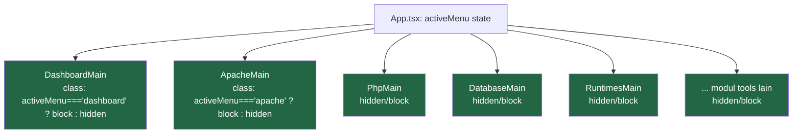
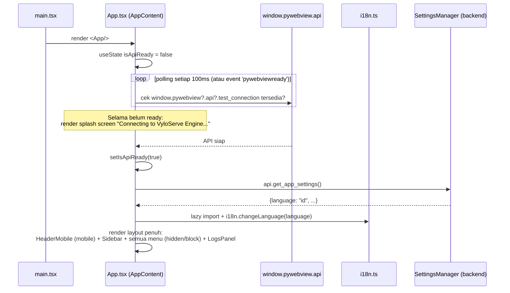
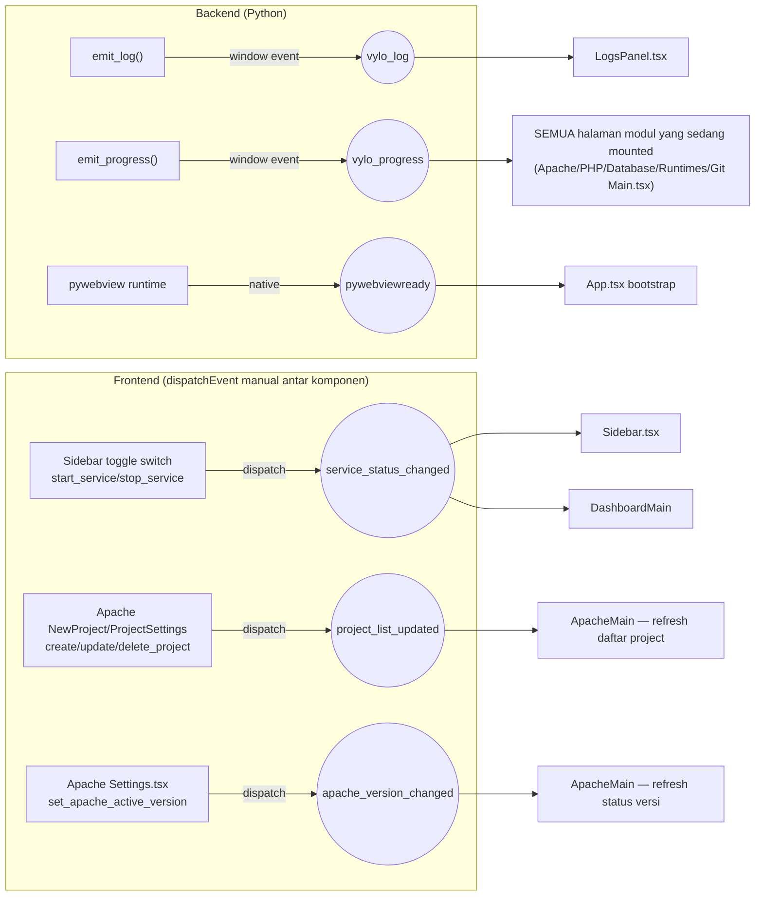
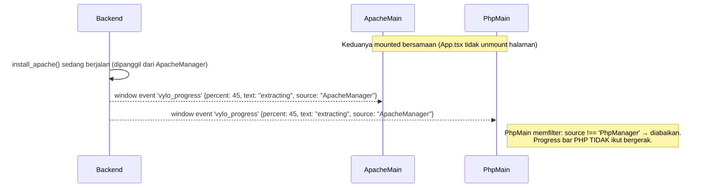
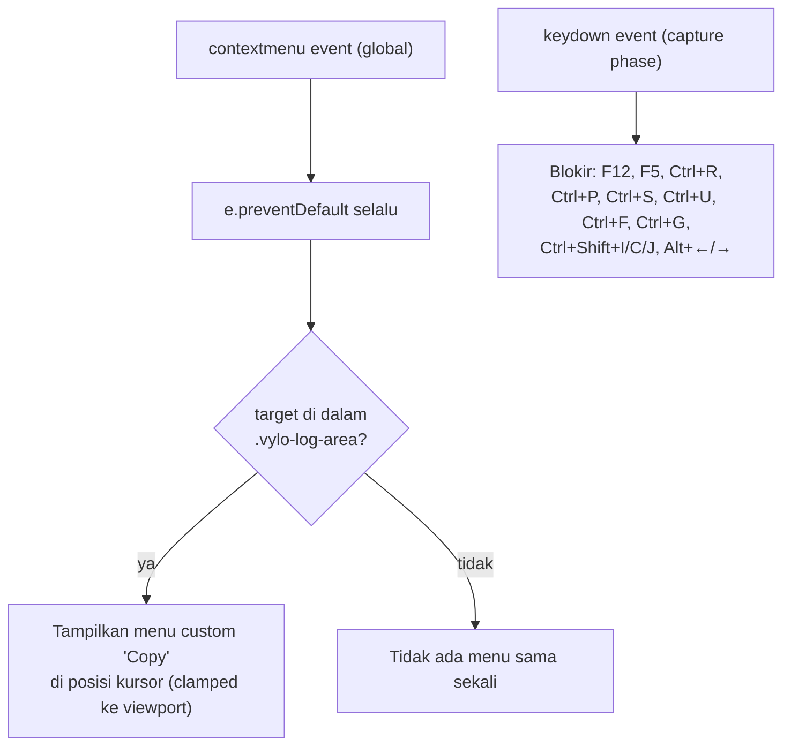
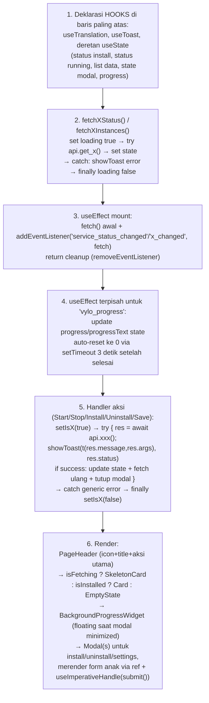
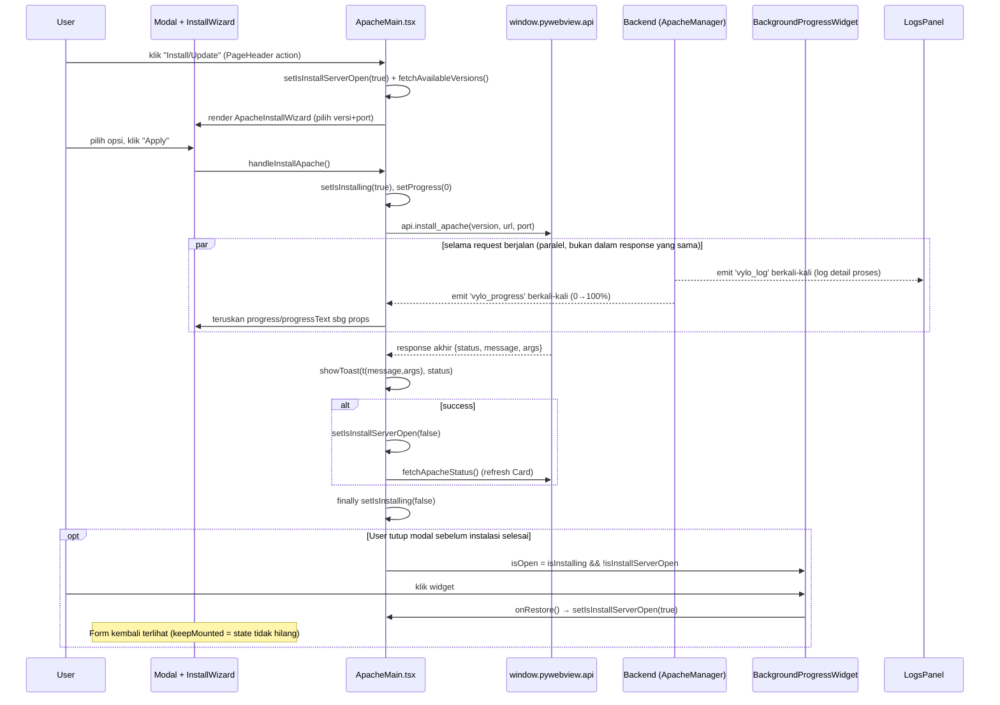
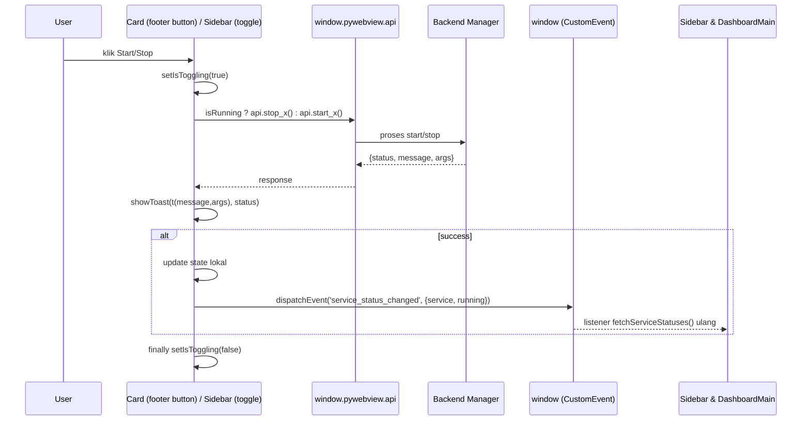

# Frontend & Antarmuka (React UI) — Dokumentasi Mendalam

> **Metodologi dokumen ini:** Ditulis berdasarkan audit langsung terhadap seluruh isi `frontend/src/` (bukan asumsi dari dokumentasi sebelumnya). Struktur folder di bawah ini adalah **struktur nyata saat ini** — dokumentasi versi lama menyebutkan folder `contexts/` dan `components/ui/` yang **tidak ada** di kode, serta menyiratkan routing berbasis React Router yang **juga tidak digunakan**. Semua perbedaan ini dicatat di [§12](#12-known-issues--ketidaksesuaian-dengan-dokumentasi-lama).
>
> Setiap alur kerja (bootstrap aplikasi, install service, toggle start/stop, event bus global) disertai diagram Mermaid yang menggambarkan urutan nyata di kode.

---

## Daftar Isi

1. [Struktur Direktori Aktual](#1-struktur-direktori-aktual)
2. [Routing & Layout Global (`App.tsx`)](#2-routing--layout-global-apptsx)
3. [Global Event Bus — Mekanisme Komunikasi Antar Komponen](#3-global-event-bus--mekanisme-komunikasi-antar-komponen)
4. [Provider & Komponen Cross-Cutting](#4-provider--komponen-cross-cutting)
5. [Anatomi Halaman "Golden Standard"](#5-anatomi-halaman-golden-standard)
6. [Sequence Diagram: Alur Install Service](#6-sequence-diagram-alur-install-service)
7. [Sequence Diagram: Alur Toggle Start/Stop](#7-sequence-diagram-alur-toggle-startstop)
8. [Modul: Apache](#8-modul-apache)
9. [Modul: PHP](#9-modul-php)
10. [Modul: Database](#10-modul-database)
11. [Modul: Dashboard](#11-modul-dashboard)
12. [Modul: Runtimes & Tools](#12-modul-runtimes--tools)
13. [Sistem i18n (Terjemahan)](#13-sistem-i18n-terjemahan)
14. [Known Issues — Ketidaksesuaian dengan Dokumentasi Lama](#14-known-issues--ketidaksesuaian-dengan-dokumentasi-lama)

---

## 1. Struktur Direktori Aktual

```text
frontend/src/
├── App.tsx                      # Root komponen — routing MANUAL via useState, BUKAN react-router
├── main.tsx                     # Entry point (createRoot)
├── i18n.ts                      # Konfigurasi react-i18next (bukan "TranslationContext")
├── index.css
├── components/                  # FLAT — tidak ada subfolder ui/
│   ├── AppInterceptor.tsx       # export default GlobalAppInterceptor
│   ├── BackgroundProgressWidget.tsx
│   ├── Card.tsx
│   ├── EmptyState.tsx
│   ├── HeaderMobile.tsx
│   ├── LogsPanel.tsx
│   ├── Modal.tsx
│   ├── PageHeader.tsx
│   ├── Sidebar.tsx
│   ├── SkeletonCard.tsx
│   └── ToastContext.tsx
├── menu/
│   ├── apache/     Main.tsx, NewProject.tsx, ProjectSettings.tsx, Settings.tsx, InstallWizard.tsx
│   ├── php/        Main.tsx, NewInstance.tsx, Settings.tsx
│   ├── database/   Main.tsx, NewInstance.tsx, Settings.tsx, ChangePassword.tsx
│   ├── dashboard/  Main.tsx
│   ├── runtimes/   Main.tsx, InstallNode.tsx, InstallPython.tsx, InstallJava.tsx, InstallGo.tsx, RuntimeVersionSelect.tsx
│   └── tools/
│       ├── git/Main.tsx
│       ├── base64-encode-decode/Main.tsx
│       ├── url-encode-decode/Main.tsx
│       ├── qr-generator/Main.tsx
│       └── settings/SettingsModals.tsx
└── locales/{en,id}/translation.json
```

> ❌ **Tidak ada** di kode (meski disebut dokumentasi lama): folder `contexts/`, folder `components/ui/`, folder `menu/project/`. Manajemen Virtual Host/Project sepenuhnya berada di dalam `menu/apache/` (`NewProject.tsx`, `ProjectSettings.tsx`), bukan modul terpisah.

---

## 2. Routing & Layout Global (`App.tsx`)

### 2.1 Routing Manual (Bukan React Router)

`activeMenu` adalah `useState<string>` (default `'dashboard'`) yang menentukan halaman aktif. Nilai valid: `dashboard, apache, php, database, runtimes, git, url-encode-decode, base64, qr`.

**Implikasi penting:** Navigasi `Sidebar.tsx` hanyalah `onSelectMenu(id) → setActiveMenu(id)` — tidak ada URL/history, tidak bisa back/forward browser (memang sengaja diblokir juga oleh `AppInterceptor`, lihat §4.2).

### 2.2 ⚠️ Semua Halaman Selalu Ter-mount Sekaligus



Semua modul di-render **sekaligus** dan disembunyikan lewat CSS class kondisional (`hidden`/`block`), **bukan** conditional render (`{cond && <X/>}`). Konsekuensi:
- **State internal setiap halaman tetap hidup** walau tidak sedang dilihat user.
- `setInterval` polling (mis. status PHP/Database tiap beberapa detik) **tetap berjalan di background** meski user sedang berada di tab lain — berdampak ke pemakaian resource kecil tapi konstan.
- Event listener tiap halaman (`vylo_progress`, dll) tetap aktif walau halaman tidak terlihat — ini adalah akar penyebab bug event-bleed yang dijelaskan di §3.3.

### 2.3 Sequence Diagram: Bootstrap Aplikasi



### 2.4 `Sidebar.tsx`

- 3 grup menu hardcoded: `MAIN_MENU` (dashboard), `SERVICES` (apache/php/database/runtimes), `TOOLS` (qr/base64/url-encode-decode/git dalam dropdown collapsible).
- **Toggle switch di tiap Service card** memanggil endpoint generik `api.start_service(id)`/`api.stop_service(id)` (bukan `start_apache_server()` spesifik) → sukses → `dispatchEvent('service_status_changed', {detail: {service, running}})` agar Dashboard & halaman modul lain ikut sinkron tanpa saling mengimpor state.
- Polling mandiri tiap 2 detik: `api.get_all_services_status()` → isi badge status tiap service + CPU% di footer sidebar.
- Search bar filter live berdasarkan nama menu ter-translate.

### 2.5 `HeaderMobile.tsx`
Header untuk layar mobile (`md:hidden`) — tombol hamburger memicu `onMenuClick` dari `App.tsx` untuk membuka overlay sidebar.

---

## 3. Global Event Bus — Mekanisme Komunikasi Antar Komponen

VyloServe **tidak memakai Redux/Zustand/Context global untuk state lintas-komponen** — sebagai gantinya, komunikasi antar komponen yang tidak punya hubungan parent-child memakai **native browser `CustomEvent` di level `window`**. Ini adalah mekanisme paling penting untuk dipahami sebelum menambah fitur baru.

### 3.1 Peta Lengkap Event



| Event | Emitter | Listener | Payload |
|---|---|---|---|
| `vylo_log` | Backend `emit_log()` | `LogsPanel.tsx` (belum memfilter `source` — menampilkan log dari semua modul apa adanya, sesuai fungsinya sebagai timeline global) | `{message, level, args, source}` |
| `vylo_progress` | Backend `emit_progress()` | Halaman modul yang sedang *mounted* — kini **memfilter berdasarkan `source`** (lihat §3.3) | `{percent, text, args, source}` |
| `pywebviewready` | Runtime pywebview (native) | `App.tsx` (bootstrap) | — |
| `service_status_changed` | `Sidebar.tsx` toggle switch | `Sidebar.tsx` (self-refresh), `DashboardMain` | `{service, running}` |
| `project_list_updated` | `NewProject.tsx`, `ProjectSettings.tsx` (Apache) | `ApacheMain.tsx` | — |
| `apache_version_changed` | `Settings.tsx` (Apache) | `ApacheMain.tsx` | — |

### 3.2 Kontrak Toast: `showToast` Menerima String yang Sudah Diterjemahkan

Konvensi ketat di seluruh codebase: pemanggil **wajib** memanggil `t(res.message, res.args)` dulu sebelum melempar ke `showToast(...)`. `ToastContext` sendiri tidak tahu apa-apa soal i18n.

```typescript
// Pola yang SELALU dipakai di semua handler:
const res = await api.some_action();
showToast(t(res.message, res.args || {}), res.status === 'success' ? 'success' : 'error');
```

### 3.3 ✅ Bug Ditemukan & Diperbaiki: Event `vylo_progress` "Bocor" Lintas Modul

Karena **semua halaman modul selalu ter-mount** (§2.2) dan **setiap halaman memasang listener `vylo_progress` sendiri**, progress bar dari instalasi Apache sebelumnya bisa ikut ter-*update* di komponen PHP jika modal PHP kebetulan sedang terbuka pada saat yang sama — payload event tidak punya field untuk membedakan progress milik modul mana.



**Solusi yang sudah diterapkan:**
- **Backend** (`core/api.py`): `emit_log()`/`emit_progress()` memakai `inspect.currentframe()` untuk otomatis mendeteksi nama class Manager pemanggil (`self.__class__.__name__`) dan menyertakannya sebagai field `source` di payload — **tanpa perlu mengubah satu-per-satu titik panggilan** `emit_progress(...)` yang tersebar di seluruh `core/services/*.py`.
- **Frontend**: setiap listener `vylo_progress` (`ApacheMain`, `NewProject` Apache, `PhpMain`, `PhpNewInstance`, `DatabaseMain`, `RuntimesMain`, Git `Main`) memfilter `e.detail.source` terhadap nama Manager yang relevan sebelum meng-update state progress. `ApacheMain` menerima dua sumber (`ApacheManager` dan `ProjectManager`) karena satu halaman itu menampilkan progress untuk instalasi Apache maupun pembuatan project baru.
- Sebagai bagian dari perbaikan ini, 4 titik di `core/services/project.py` yang sebelumnya memanggil `window.evaluate_js()` secara manual (bypass `emit_progress`, dengan escaping string manual yang rawan) diubah memakai `self._progress()` sehingga otomatis ikut mendapat `source` yang benar sekaligus escaping JSON yang aman (`json.dumps`).

---

## 4. Provider & Komponen Cross-Cutting

### 4.1 `ToastContext.tsx`
Context + Provider standar. `useToast()` → `showToast(message, type)`. 4 tipe (`success|error|warning|info`), auto-hilang 4000ms, container `fixed bottom-6 right-6`. **Menerima string yang sudah diterjemahkan** (lihat §3.2) — tidak terhubung langsung ke sistem i18n.

### 4.2 `AppInterceptor.tsx` (`export default GlobalAppInterceptor`)



Klik di mana saja menutup context menu custom. Copy handler pakai `navigator.clipboard.writeText` dengan fallback try/catch + toast.

### 4.3 `LogsPanel.tsx`
Panel log **fixed di bawah layout**, collapsible & resizable (drag strip 1.5px, clamp 100px–80% tinggi viewport). Listener: `window.addEventListener('vylo_log', handler)` → `t(detail.message, detail.args)` (i18next fallback aman ke string asli jika key tidak ditemukan). Auto-scroll ke bawah kecuali user sudah scroll manual (`onWheel` mematikan `isAutoScroll`). Tombol: copy semua log (fallback `document.execCommand('copy')` untuk non-secure-context), toggle auto-scroll, clear, expand/collapse.

> Catatan: `LogsPanel` adalah **timeline log**, bukan progress bar. Progress bar ada terpisah di `BackgroundProgressWidget` + progress bar inline per form instalasi.

### 4.4 `BackgroundProgressWidget.tsx`
Widget mengambang generik (pojok kanan-bawah) untuk kondisi "modal instalasi diminimize/ditutup tapi proses backend masih jalan". **Murni presentational** — props `{isOpen, progress, progressText, title?, onRestore}`, tidak mendengarkan event sendiri (parent yang dengar `vylo_progress` lalu meneruskan sebagai props). Auto-hide jika `progress <= 0 || progress >= 100`. Klik → `onRestore()` membuka kembali modal.

### 4.5 `Modal.tsx`
Komponen generik dipakai **semua** modal di aplikasi. Props kunci: `isOpen, onClose, title, icon, children, onApply, applyText, isDanger, isDestructive, isLoading, keepMounted, customHeader, customFooter`.
- **`keepMounted`**: form instalasi tetap ada di DOM walau modal "ditutup" secara visual — dikombinasikan dengan `BackgroundProgressWidget` untuk pola "minimize" tanpa kehilangan state form/progress.
- ESC & klik-overlay menutup modal, kecuali `isDestructive || isLoading`.

### 4.6 `Card.tsx`, `PageHeader.tsx`, `EmptyState.tsx`, `SkeletonCard.tsx`
Komponen presentational murni. `Card` auto-tema warna badge berdasarkan substring teks status (`running/active`→hijau, `error/fail/offline`→merah, `native/os/system`→biru, default abu-abu).

---

## 5. Anatomi Halaman "Golden Standard"

> ⚠️ Koreksi dari dokumentasi lama: pola ini **bukan eksklusif milik Apache & PHP** — pola identik (`PageHeader + SkeletonCard + EmptyState + Card + Modal`) diterapkan konsisten di **Apache, PHP, Database, Runtimes, dan Git**.



**Pola `ref` + `useImperativeHandle`:** Form di dalam Modal (mis. `ApacheInstallWizard`, `NewProject`) mengekspos method `submit(): Promise<boolean>` lewat `useImperativeHandle`, sehingga tombol "Apply" yang dikendalikan oleh `Modal.tsx` (parent) bisa memicu logic submit yang sebenarnya berada di komponen form anak — pola ini dipakai konsisten di semua form modal.

---

## 6. Sequence Diagram: Alur Install Service

Contoh konkret: **Install Apache** — pola yang sama berlaku untuk install PHP/Database/Node/Python/Java/Go/Git.



**Poin desain penting:** Request `api.install_apache(...)` adalah **request-response tunggal** (await sampai selesai) — progress bar **tidak** berasal dari response ini, melainkan dari event `vylo_progress` terpisah yang ditembakkan backend secara paralel selama proses berjalan. Ini pola async gabungan (request-response + event streaming) yang lebih kompleks dari sequence diagram sederhana di `docs/architecture_and_flow.md` — dokumen tersebut sudah benar soal konsep dasarnya tapi tidak menjelaskan kombinasi kedua pola ini.

---

## 7. Sequence Diagram: Alur Toggle Start/Stop

Identik untuk Apache/PHP/Database (via Card footer button) maupun via Sidebar toggle switch.



---

## 8. Modul: Apache

| File | Peran |
|---|---|
| `Main.tsx` | State terbesar — status Apache global (installed/running/version/path) + daftar Virtual Host project (CRUD). 2 `useEffect` independen (fetch project, fetch status apache). Listen: `project_list_updated`, `service_status_changed`, `vylo_progress`, `apache_version_changed`. |
| `NewProject.tsx` (forwardRef) | Form 2-mode: "Fresh Install" (scaffold Composer) vs "Link Existing" (`api.browse_directory()` → `api.detect_framework(path)`, auto-append `/public` untuk Laravel/CodeIgniter). **Satu-satunya pemakaian `localStorage`** di seluruh frontend (`vylo_install_loc` — menyimpan lokasi install terakhir). Submit → `api.create_project()` → dispatch `project_list_updated`. |
| `ProjectSettings.tsx` (forwardRef) | Edit nama project & rebind versi PHP untuk vhost existing (domain read-only). Submit → `api.update_project()` → dispatch `project_list_updated`. |
| `Settings.tsx` | Modal "Global Apache Config" — pilih versi aktif (`set_apache_active_version` → dispatch `apache_version_changed`), shortcut buka `httpd.conf`/`vhosts.conf`/`error.log`. |
| `InstallWizard.tsx` | Deteksi OS dari `navigator.userAgent` (murni display), pilih versi+port, auto-scroll ke progress bar saat instalasi mulai. |

---

## 9. Modul: PHP

| File | Peran |
|---|---|
| `Main.tsx` | Daftar instance PHP FastCGI multi-versi. Tiap instance start/stop independen (`start_php(version)`/`stop_php(version)`). Config dibuka on-demand (fetch saat modal dibuka, bukan preload). |
| `NewInstance.tsx` | Pilih versi, validasi port real-time terhadap `usedPorts` (dihitung dari instance existing), rekomendasi port otomatis `max(usedPorts)+1`. |
| `Settings.tsx` | Form config generik (port, memory_limit, dll) + toggle ekstensi (search filter client-side) — validasi konflik port real-time (exclude diri sendiri). |

---

## 10. Modul: Database

| File | Peran |
|---|---|
| `Main.tsx` | Dual-engine (MySQL/MariaDB & PostgreSQL), tab filter client-side. Listener progress unik: `percent < 0` = reset/cancel, `percent >= 100` = auto-close modal + refetch. |
| `NewInstance.tsx` (forwardRef, expose `getFormData()` — **beda pola** dari modul lain yang expose `submit()`; parent yang panggil `api.install_database()` langsung) | Custom dropdown searchable untuk versi, deteksi OS, password wajib untuk PostgreSQL. |
| `Settings.tsx` | Form config berbeda total per engine: MySQL (`innodb_buffer_pool_size`, `character_set_server`) vs PostgreSQL (`shared_buffers`, `work_mem`). |
| `ChangePassword.tsx` (forwardRef, expose `submit()`) | Mengharuskan instance `status === 'running'`. Panggil `api.change_db_credentials(id, user, old, new)`. |

---

## 11. Modul: Dashboard

`Main.tsx` bukan sekadar tampilan read-only — berisi **mini Global Control Panel**:

```mermaid
flowchart TD
    Load["Mount: get_dashboard_config()<br/>isConfigLoaded.current = false selama loading"] --> Guard["useEffect auto-save<br/>DIJAGA oleh isConfigLoaded.current<br/>(cegah overwrite config sebelum load awal selesai)"]
    Guard --> UserToggle["User toggle includedServices/selectedPhp/selectedDb"]
    UserToggle --> AutoSave["save_dashboard_config() — overwrite total (lihat §11 backend)"]

    ToggleAll["handleToggleAll('start')"] --> Step1["1. set versi Apache aktif"]
    Step1 --> Step2["2. start semua PHP terpilih (skip yang sudah running)"]
    Step2 --> Step3["3. start semua DB terpilih"]
    Step3 --> Step4["4. start Apache<br/>(urutan: PHP dulu, baru Apache — hindari gateway crash)"]
```



Sparkline CPU/RAM: SVG custom (cubic-bezier path manual, bukan library chart), riwayat 20 titik data di-update tiap polling 3 detik.

---

## 12. Modul: Runtimes & Tools

### Runtimes
Tab-based (Node/Python/Java/Go), tiap engine punya komponen `InstallX.tsx` terpisah (dipanggil via `ref.current.submit()`). Jika `external.exists` terdeteksi (native install di OS), toggle "Add to PATH" **dikunci (disabled)** dengan pesan warning untuk mencegah konflik PATH. Pola "minimize modal" dengan `isMinimized` state terpisah dari `isNewInstanceOpen` (bisa diminimize manual, tidak hanya auto saat modal ditutup).

### Git (`tools/git/Main.tsx`)
Struktur sama seperti Runtimes (deteksi eksternal/native, PATH toggle terkunci jika ada Git native) + form Global Config (`user.name`/`user.email` via `get_git_config`/`set_git_config`).

### Base64 & URL Encode/Decode
**100% client-side** — tidak ada pemanggilan `window.pywebview.api` sama sekali kecuali clipboard/toast. Base64: `TextEncoder`/`TextDecoder` + `btoa`/`atob` (UTF-8 safe), mendukung mode file (drag-drop → `FileReader.readAsDataURL`, deteksi otomatis preview image dari data-URI). URL tool: parsing native `URL` API untuk visualisasi hierarki protocol/host/path/query.

### `SettingsModals.tsx`
3 modal terpusat (language/about/quit) dari footer Sidebar. Language modal menyimpan ke **dua sumber kebenaran**: `i18n.changeLanguage()` (runtime) **dan** `api.save_app_settings({language})` (persisted) — disinkronkan ulang saat `App.tsx` mount via `get_app_settings()`.

---

## 13. Sistem i18n (Terjemahan)

- Konfigurasi murni di `src/i18n.ts` via `react-i18next` + `i18next-browser-languagedetector` (fallback `en`).
- **Kontrak universal:** backend selalu return `{status, message: "translation.key", args?}` → frontend selalu `t(res.message, res.args || {})` sebelum `showToast(...)`.
- **Fallback aman:** jika key tidak ditemukan di JSON, `t()` mengembalikan string key aslinya apa adanya (tidak error) — kadang dipakai secara sengaja sebagai default value literal (`t(sidebar.menu_${id}, item.name)`, argumen kedua sebagai fallback teks bukan args interpolasi).
- Namespace key: `apache.*`, `php.*`, `database.*`, `runtimes.*`, `dashboard.*`, `tools.git.*`, `tools.base64.*`, `tools.url.*`, `components.*` (shared: interceptor/logs/progress), `sidebar.*`, `settings.*`, `common.*`.
- **Dual source-of-truth bahasa**: state runtime i18next vs `data/settings.json` persisted — disinkronkan setiap `App.tsx` bootstrap (§2.3).

---

## 14. Known Issues — Ketidaksesuaian dengan Dokumentasi Lama

| # | Klaim dokumentasi lama | Realita di kode | Dampak |
|---|---|---|---|
| 1 | Ada folder `contexts/` (ThemeContext, TranslationContext) | **Tidak ada** — i18n dikonfigurasi langsung di `src/i18n.ts`; tidak ditemukan Context/toggle tema manual (dark mode murni via Tailwind `dark:` class) | 🟡 Struktur folder salah di dokumentasi |
| 2 | Ada folder `components/ui/` | **Tidak ada** — semua komponen flat di `components/` | 🟡 Struktur folder salah |
| 3 | Ada folder `menu/project/` terpisah | **Tidak ada** — CRUD project menyatu di `menu/apache/` | 🟡 Struktur folder salah |
| 4 | Routing tersirat pakai React Router | **State manual** (`activeMenu`) — semua halaman selalu mounted, disembunyikan via CSS | 🟡 Berdampak nyata ke perilaku (state persistence, event listener duplikasi — lihat #6) |
| 5 | "Golden Standard" hanya disebut untuk Apache & PHP | Pola identik juga diterapkan di Database, Runtimes, Git | 🟢 Penyempitan cakupan di dokumentasi lama |
| 6 | Tidak ada dokumentasi soal event `vylo_progress` yang bisa "bocor" ke modul lain | Bug nyata yang ditemukan saat audit — **sudah diperbaiki** dengan field `source` + filter di listener (§3.3) | ✅ Diperbaiki |
| 7 | Custom event bus (`service_status_changed`, `project_list_updated`, `apache_version_changed`) tidak disebut sama sekali | Ini mekanisme state-sync utama antar komponen di seluruh aplikasi | 🟡 Gap dokumentasi signifikan — sudah dilengkapi di §3 |
| 8 | Tidak disebutkan pemakaian `localStorage` | Dipakai 1 tempat: `NewProject.tsx` (`vylo_install_loc`) | 🟢 Minor gap |
| 9 | Tidak disebutkan dual source-of-truth bahasa (i18next runtime vs `settings.json`) | Dikonfirmasi ada, disinkronkan saat bootstrap | 🟢 Minor gap |
| 10 | File-file berikut tidak disebut sama sekali di dokumentasi lama | `NewProject.tsx`, `ProjectSettings.tsx`, `InstallWizard.tsx`, `NewInstance.tsx` (PHP/Database), `ChangePassword.tsx`, `InstallNode/Python/Java/Go.tsx`, `RuntimeVersionSelect.tsx`, `SettingsModals.tsx`, `qr-generator/Main.tsx` | 🟡 Cakupan dokumentasi lama terlalu sempit |

> Lihat juga `docs/project_structure.md` yang sudah dikoreksi agar konsisten dengan struktur folder nyata di atas.
